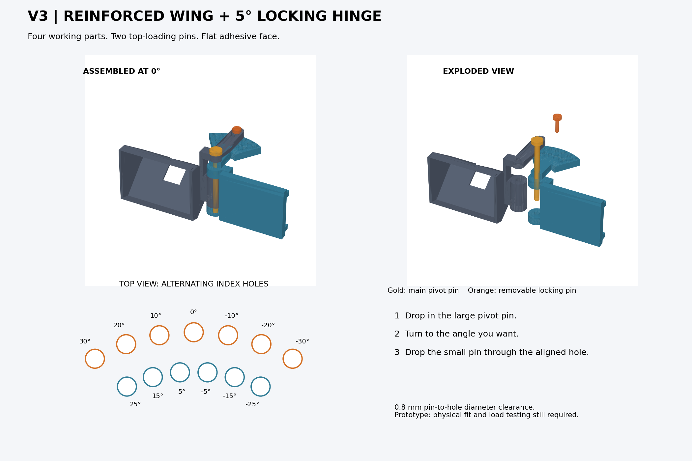

# Stream Deck Mini side monitor mount

A 3D-printable mount that places a six-button Stream Deck Mini in landscape beside the left edge of a monitor. The shaped cradle holds the front fascia upright. A reinforced adhesive wing and a two-pin hinge provide locking positions every 5° from −30° to +30°.

**Prototype:** these files passed digital mesh and collision checks, but have not been physically printed or load-tested. The device pocket is estimated from product photographs. Print the small fit checks before the full mount.

## Download the parts

Open a file below and use GitHub's **Download raw file** button to save it. Print one of each working part.

| File | Purpose |
| --- | --- |
| [01_Holder.stl](01_Holder.stl) | Upright wedge cradle and moving hinge section |
| [02_Reinforced_Wing.stl](02_Reinforced_Wing.stl) | Flat adhesive wing, rear reinforcement, and index plate |
| [03_Pivot_Pin.stl](03_Pivot_Pin.stl) | Large top-loading hinge pin |
| [04_Locking_Pin.stl](04_Locking_Pin.stl) | Small removable angle-lock pin |
| [05_Device_Fit_Gauge.stl](05_Device_Fit_Gauge.stl) | Optional small check of the Mini's housing profile |
| [06_Pin_Fit_Coupon.stl](06_Pin_Fit_Coupon.stl) | Small check of both pin clearances |

No purchased screws, nuts, springs, or bearings are required. Mounting tape is needed for the monitor and thin internal adhesive retains the Mini.

## Print in PLA

- Use millimetres, 100% scale, 0.20 mm layers, 5 walls, and 6 top/bottom layers.
- Use 40% infill for the holder and wing; 100% infill for both pins.
- The holder and wing are exported side-down and **require removable supports** under raised features.
- The pins are exported head-down. Use a brim for the tall pivot pin and holder.
- Remove support residue from bores before assembly. The 6 mm pivot uses a 6.8 mm bore; the 4 mm locking pin uses 4.8 mm holes. Nominal hinge gaps are 0.7 mm. Actual fit depends on the printer.

See [complete printing and assembly instructions](PRINT_AND_ASSEMBLE.txt) for dimensions and setup details.

## Assemble and adjust

1. Place the holder's middle barrel between the wing's two hinge barrels, with its index arm above the index plate.
2. Drop the large pivot pin through the top arm and hinge barrels.
3. Rotate to the desired angle and drop the small locking pin through the aligned index holes.
4. Insert the Mini from the front, three buttons across and two down. Secure it with thin internal adhesive and leave cable slack for swivelling.
5. Tape the flat wing face to the monitor's back. All reinforcement is on the opposite side. Follow the tape's curing instructions before loading it.

To change angle, remove **only the small locking pin**, turn the holder, and replace the pin. The outer row supplies multiples of 10°; the inner row supplies the intervening 5° positions. Both pins are gravity-retained, so keep the assembly upright. There are no hard end stops with the locking pin removed.

## Fit and clearance

At 0°, the nominal fascia plane aligns with a **10 mm monitor plus 1 mm compressed tape**. Turning the vertical hinge changes the sideways viewing angle; the face is coplanar with the screen only at 0°.

The wing measures 76 × 60 × 8 mm, with rear rails adding 6 mm. Allow about 27 mm between the cradle and adhesive wing for the hinge. The index plate extends approximately 80 mm behind the face plane. Keep monitor ventilation and hot exhaust clear.

## Editable model and validation

- [Hinged_Mount.scad](Hinged_Mount.scad): OpenSCAD source with part selectors and monitor/tape parameters.
- [collision_check.scad](collision_check.scad): nominal holder/wing interference check at all 13 indexed positions.
- [MESH_CHECKS.json](MESH_CHECKS.json) and [DIGITAL_VALIDATION.txt](DIGITAL_VALIDATION.txt): digital validation results. These do not establish physical fit or load capacity.

The housing envelope is based on [Elgato's Stream Deck Mini specifications](https://help.elgato.com/hc/en-us/articles/10836894087309-Elgato-Stream-Deck-Mini-Technical-Specifications); the wedge profile is estimated from a [side-view product photograph](https://geartechs.com/products/elgato-stream-deck-mini-compact-6-key-tactile-control-pad).

## Project and documentation

[AgentStreamDeck overview](../../README.md) · [Documentation index](../../docs/README.md) · [Hardware support](../../docs/features/HARDWARE.md) · [Visual gallery](../../docs/GALLERY.md).
