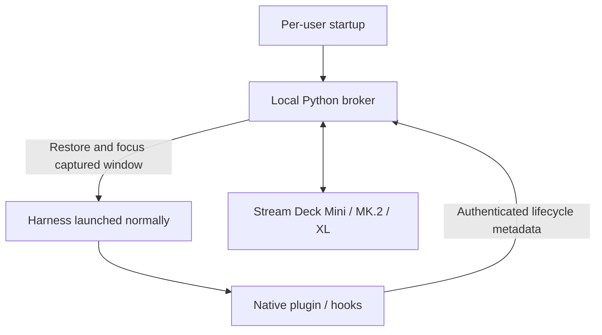

# AgentStreamDeck

<p align="center">
  
</p>

**Mission control for AI coding agents on your Stream Deck.** See activity at a glance, then press a key to focus the right session. Jelly, the offline coding companion introduced in v3.0, lives in the keys you are not using.

[](https://github.com/darkmatter2222/AgentStreamDeck/actions/workflows/ci.yml)
[](https://github.com/darkmatter2222/AgentStreamDeck/stargazers)
[](https://github.com/darkmatter2222/AgentStreamDeck/forks)
[](LICENSE)
[](pyproject.toml)
[](#requirements)
[](#requirements)

> **☕ Support my work**
>
> If this project has helped you, consider supporting my work on [**Buy Me a Coffee**](https://buymeacoffee.com/j6oiubzfnh). Any one-time or monthly support goes directly back into these open-source projects, the hardware behind them, and the videos and documentation around them.

> ⭐ **If AgentStreamDeck is useful, [star the repo](https://github.com/darkmatter2222/AgentStreamDeck).** It helps other developers find the project.

AgentStreamDeck connects OpenCode, Claude Code, GitHub Copilot CLI, Copilot in VS Code, Gemini CLI, Cursor CLI and Codex CLI to one local controller over direct USB HID. No Elgato plugin or MCP server is required.

> **Upgrading from AgentDeck?** The Python distribution is now `agentstreamdeck`; the `ocdeck` command, existing configuration and hook receipts remain compatible. See [rename and upgrade steps](docs/RENAMING.md).

## Pip upgrades restart the broker automatically

With **v3.0.5 or newer already running**, update using your normal Python environment:

```powershell
python -m pip install --upgrade agentstreamdeck
```

The broker notices the newly installed version, waits for pip to finish and the
installation to remain stable, verifies the package files and a fresh import,
then restarts itself in the background. Usually this takes **10–20 seconds after
pip finishes**, plus broker shutdown/startup time. Your configuration folder is
preserved. No open terminal or separate stop/start commands are needed.

**Moving from v3.0.4 or older?** Use Jelly's red `!` update button for the first
upgrade; it already installs and restarts for you. If you use pip for that first
upgrade, restart the broker once to load the new watcher. Afterward, normal pip
upgrades are enough. The broker must be running, and pip must use its Python
environment. Pip alone does not start a stopped broker or set up a first install.

This works offline and independently of online update checks. Set
`"auto_restart_on_upgrade": false` in `config.json` to keep manual restarts.
Editable installs and source checkouts are excluded. Reinstalling the same
version does not trigger a restart. Clients reconnect through their normal
heartbeat or next native hook event.

## Jelly taps and coffee breaks

**Tap Jelly and he reacts.** A playful wobble, dance or cheer comes with a short
“Boop!”, “Ouch!” or another little response, even when ambient thoughts are off.
Pressing a minimized agent's key now maximizes its window and brings it forward.


Every **random 1–3 hours**, when **at least two buttons are unassigned**, Jelly
settles on one and points toward a steaming Buy Me a Coffee cup on the other.
He cycles through rainbow colors with **“Coffee?”** above his head. The pair can
be anywhere on the deck. After **60 seconds**, the invitation disappears.
Tap the cup to open [Ryan's support page](https://buymeacoffee.com/j6oiubzfnh)
in your default browser and dismiss the invitation immediately.

Agent controls always take priority: if an agent needs either key, the coffee
break ends. Each completed or dismissed break schedules a fresh 1–3 hour delay;
restarting the broker starts a new delay. Nothing opens without a cup press.
The cup artwork is bundled, so the animation needs no network access.

Set `"jelly": {"coffee": false}` to disable invitations, or
`"jelly": {"coffee_rainbow": false}` to keep Jelly's normal mood colors.
An available update's red `!` takes priority; tapping that marked Jelly still
installs the update. Preview timing above is compressed.

## New in 3.0 — Meet your coding Jelly

**Your Stream Deck has a little life of its own.** Jelly is an offline coding pet,
**enabled by default**, who makes a home at the bottom of an unused button.
He scoots, stretches, dances and naps inside his key, then hops across to visit
another. Keep coding and he stays fed and active; long quiet spells bring out
his sleepy side. A busy deck can leave him feeling overworked, too.

[Watch the HD animation](docs/jelly/jelly_v3_showcase.mp4) ·
[Meet Jelly and customize his personality](#living-jelly-your-coding-pet) ·
[3.0 release notes](docs/releases/v3.0.0.md)

- **33 actions, 33 poses and 14 hop styles:** a companion who can live within a
  button, with his resting position anchored to its bottom edge.
- **23 color-changing moods and four personalities:** playful, curious, proud,
  sleepy, helpful and more, shaped by six simulated needs.
- **Agent-aware reactions:** he looks, points or approaches a free button near an
  agent that needs attention, and celebrates explicit successful outcomes.
- **1,040 authored thoughts:** occasional scrolling text above his head, generated
  entirely offline. Activity metadata feeds his needs; source code and prompts
  are never read to feed him.

Jelly only uses unassigned buttons. Agent controls always take priority. Existing
`jelly.enabled: false` settings remain respected; to opt out, add
`"jelly": {"enabled": false}` to your configuration. Global animations off also
turns Jelly off. [All Jelly settings](#living-jelly-your-coding-pet).

## Features carried forward from 2.1

Version 3.0 retains these 20 enhancements introduced in 2.1.
Physical-device/native-harness acceptance remains documented in
[validation status](#validation-status).

| # | Enhancement | What it adds |
|---|---|---|
| 1 | Sound alerts | Optional WAV/default chime, selected states, slot muting and global rate limit |
| 2 | PR test automation | Python and Node suites on Windows/Ubuntu, Python 3.11/3.13, and the CI badge above |
| 3 | Windows toasts | Notifications for newly identified input requests; snapshot deduplication and interruption checks |
| 4 | `ocdeck doctor` | PASS/FAIL/MANUAL diagnostics with fixes, JSON output and a no-device option |
| 5 | `ocdeck report` | Redacted status, versions, configuration and bounded log excerpts in a ZIP |
| 6 | Structured logs | Rotating JSON logs, request correlation IDs and recent errors in status |
| 7 | Secret-scrubbing tests | Randomized snapshot, rendered-label, log, report and hook-metadata coverage |
| 8 | Release notices | Background latest-release check, notes, once-per-version cache and offline/disable behavior |
| 9 | Pre-commit hooks | Ruff lint/format and a syntax check for every changed JavaScript module |
| 10 | Larger Stream Decks | Mini (6), Original/MK.2 (15), XL (32), automatic capacity and overflow handling |
| 11 | Codex CLI | Project native-hook installer, direct broker delivery and an opt-in live acceptance runner |
| 12 | Input counts | Known OpenCode counts shown as 1–9 or `9+`; unknown hook totals remain unknown |
| 13 | Type-check gate | Pyright basic across `ocdeck/` with incremental concrete types |
| 14 | Python packaging/releases | Complete wheel/sdist, clean-install check, SBOM/checksums and trusted-publishing attestations workflow |
| 15 | Complete integration uninstall | Project receipt discovery, preflight, dry-run, hook preservation and backups |
| 16 | Actionable errors | Stable AD error codes, fix/check commands and troubleshooting links |
| 17 | High-contrast theme | Sixth palette, renderer example and contrast test |
| 18 | Appearance dry-run | Settings diff and in-memory sample preview without writing files |
| 19 | Appearance sharing | Versioned JSON import/export with strict validation |
| 20 | Elgato conflict detection | Conservative process guard before opening hardware and a doctor check |

[Setup](#get-started) · [Codex](#set-up-codex-cli) · [Deck sizes](#supported-decks-and-slot-capacity) ·
[Appearance](#make-every-key-your-own) · [Alerts](#sound-alerts-and-windows-notifications) ·
[Diagnostics](#diagnostics-logs-and-bug-reports) · [Configuration](#commands-and-configuration) ·
[Uninstall](#uninstall-and-backups) · [Releases](#updates-packaging-and-release-status) ·
[Detailed feature guide](docs/NEXT.md)

## Demo video

[](https://www.youtube.com/watch?v=NTWLbLbJiO0)

[Watch on YouTube](https://www.youtube.com/watch?v=NTWLbLbJiO0). The original demo
shows the OpenCode workflow; additional adapters have the coverage described below.


## Choose your harness

| Harness | Integration / launch | Pending-input coverage |
|---|---|---|
| OpenCode | Global server plugin; launch `opencode` normally | Permission and structured-question IDs; SDK reconciliation when available |
| Claude Code | Project native hooks; launch `claude` normally | Identified `AskUserQuestion` calls; permission hooks show unknown instead of an invented count |
| GitHub Copilot CLI | Project native hooks; launch `copilot` normally | Activity only; approvals may still appear running |
| Copilot in VS Code | Project native hooks; launch VS Code normally | Activity only; isolated editor profile, preview integration |
| Gemini CLI | Project native hooks; launch `gemini` normally | Activity; recognized permission notifications show unknown |
| Codex CLI | Project native hooks; launch `codex` normally | Observed approval state with unknown count; review hooks using `/hooks` |
| Cursor CLI (`agent`) | Project native hooks; launch `agent` normally | Activity only; Cursor desktop integration is not included |

The six project-hook profiles plus the OpenCode global plugin are implemented and fixture-tested. Windows/Ubuntu CI
exercises mocked hardware and subprocess transport. Live native-hook loading,
interactive Windows focus/notifications and physical USB behavior require local validation. A non-red key does **not** prove that no approval is waiting.
See [adapter details](docs/HARNESSES.md) for lifecycle and missed-event limitations.
Aider and cloud/remote agent integrations are not included.

| Condition | Key appearance |
|---|---|
| Device initialized, no registered launches | Cyan **READY** on key 1; remaining keys black |
| Reported busy or retry | Green moving ring |
| Reported idle | Amber breathing glow |
| Identified input or observed Codex approval request | Red pulsing attention icon |
| Unknown or snapshots stale for more than 10 seconds | Amber **LINK ?** |
| Empty slot | Black; pressing it does nothing |

A key press requests focus only. It never types, approves a tool, answers a question,
or changes an agent's state. Windows can deny foreground activation; inspect
`lastFocus` in `ocdeck status` and verify physical behavior on your desktop.

## Requirements

| Component | Requirement |
|---|---|
| Hardware | Stream Deck Mini (6), Original/MK.2 (15), or XL (32) |
| Python | 3.11+ |
| Node.js | 20+ for native JavaScript hook adapters |
| Windows | Full USB control and one-touch window focus; Elgato Stream Deck must release the device |
| Linux | Broker auto-start via a per-user systemd service; desktop focus is not currently implemented |

## Get started

The normal installation is intentionally launcher-free. Install the Python package once, then let AgentStreamDeck register its per-user broker at login:

```powershell
python -m pip install --upgrade agentstreamdeck
ocdeck install
```

On **Windows**, `ocdeck install` creates and starts the per-user **AgentStreamDeck Broker** Scheduled Task. On **Linux**, it creates and enables `agentstreamdeck.service` as a systemd user service. The broker owns the Stream Deck and starts automatically for future sessions. `ocdeck install` also installs the OpenCode server plugin automatically when `opencode` is already on PATH.

Then install the native observer hook for each harness/project you want on the deck:

```powershell
cd C:\Projects\MyApp
ocdeck harness-install claude
ocdeck harness-install codex
ocdeck harness-install copilot-cli
ocdeck harness-install gemini
ocdeck harness-install cursor
```

After that, start the harness **the way you normally do**: `claude`, `codex`, `copilot`, `gemini`, `agent`, your own BAT file, a local-model launcher, or an IDE shortcut. The installed plugin/hook talks directly to the local broker. `ocdeck start`, `harness-launch`, and the legacy `Launch-*.bat` files remain compatibility helpers, not requirements.

For Copilot in VS Code, install the `copilot-vscode` profile instead. OpenCode uses its global plugin rather than a per-project native hook. Hook installation preserves unrelated configuration and writes a receipt/backups before changes.

If you want an AI coding agent to set this up for you, give it this instruction:

```text
Go to https://github.com/darkmatter2222/AgentStreamDeck and follow the current README and docs/HARNESSES.md. Install AgentStreamDeck from PyPI, run `ocdeck install` so the broker starts automatically, then install the native AgentStreamDeck plugin/hook for the harnesses I use. Preserve my existing harness configuration. Do not require an AgentStreamDeck launcher; I want to start each harness normally. Verify with `ocdeck status` and the physical button test.
```

### Install/update AgentStreamDeck

```powershell
python -m pip install --upgrade agentstreamdeck
ocdeck install
```

The broker checks PyPI for updates. When Jelly carries a red `!`, press the button Jelly occupies to approve the exact detected update. No package is installed merely because an update was found.

### Set up Codex CLI

```powershell
cd C:\Projects\MyApp
ocdeck harness-install codex
codex
```

Open `/hooks` in Codex to review and trust the installed observer hooks. AgentStreamDeck never grants trust or approval decisions.

### Supported decks and slot capacity

| Device family | Agent slots | Selection |
|---|---|---|
| Stream Deck Mini | 6 | Automatic product/driver detection |
| Stream Deck Original / MK.2 | 15 | Automatic product/driver detection |
| Stream Deck XL | 32 | Automatic product/driver detection |

One broker controls one deck. Use `ocdeck devices` to list models, serials and key
counts. Set `serial` in config when more than one matching deck is attached.
Capacity resizes on attachment; overflow launches take a freed slot in registration
order. Resizing invalidates stale key-press assignments. These are agent/focus
slots; arbitrary custom action keys and multi-deck aggregation are not included.

The broker conservatively refuses hardware access while an Elgato Stream Deck
process is running. Quit it from the tray. If you have explicitly released this
device in Elgato and need other devices there, `"allow_elgato": true` disables the
process guard; it does not release a device on your behalf. `hardware-check`
requires Elgato to be closed. For mock capacity only, configure `"slots": 15` or
`32`; physical hardware supplies its own capacity.

### Using HomeAILab or another local-model launcher?

Use it normally. Once the native hook/plugin is installed, AgentStreamDeck does not need to own the launch command. The hook reports lifecycle metadata straight to the broker. On Windows, the broker captures the containing visible window when the session starts so a physical key can restore/focus it. For deterministic focus, keep one monitored harness per OS window; multiple tabs owned by one Windows Terminal process can be inherently ambiguous.

## Make every key your own


The preview demonstrates several states together. In normal use, READY appears only when no
agents are registered. Windows hardware and native harness acceptance gates are
tracked in [the verification record](docs/TEST-RESULTS.md).

Three layouts. Six palettes. Two text lines you control. Each button can have its
own look, brightness, and motion. These examples come directly from AgentStreamDeck's
renderer using sample sessions; they are enlarged key previews, not hardware photos.
Harness mode uses bundled official app icons and GitHub's Copilot UI icon where
available. Codex uses a text identifier and procedural status symbol.
[Asset sources and attribution](THIRD-PARTY.md#harness-icons) are included; no runtime downloads are needed.

[Layouts](#three-ways-to-see-your-agents) · [Themes](#six-color-palettes) ·
[Harness icons](#recognize-the-harness) · [Text](#choose-the-text-under-each-icon) ·
[Motion](#breathing-glowing-or-still) · [Mixed deck](#mix-it-up-button-by-button)

### Real logos, plus ten more ways to customize

Use the actual OpenCode, Claude, Copilot, Gemini, and Cursor icons. Their artwork
keeps its source colors; your palette controls the surrounding status indicators.


| New feature | What you can do | Example |
|---|---|---|
| 1. Custom aliases | Give a physical slot a name that replaces its project label | `--slot 2 --alias "Reviewer"` |
| 2. Scrolling text | Read long labels with clipped, eased, back-and-forth motion | `--text-effect scroll` |
| 3. Shimmer text | Add a moving highlight across the text | `--text-effect shimmer` |
| 4. Text sizes | Choose small, normal, or large type | `--text-size large` |
| 5. Text alignment | Align both lines left, center, or right | `--text-align left` |
| 6. Status badges | Choose a dot, symbol ring, or short text pill in Harness layout | `--badge pill` |
| 7. Borders | Solid, double, corner accents, or no border | `--border corners` |
| 8. Backgrounds | Solid, a soft gradient, or a subtle grid | `--background grid` |
| 9. Logo sizing | Small, normal, or large official icons in Harness layout | `--logo-size large` |
| 10. Named presets | Apply Studio, Neon, Focus, Readable, or Marquee styling | `--preset neon` |

#### Name your agents and style their text

Aliases belong to slots, so “Reviewer” stays on key 2 even if a different agent
later occupies it. An empty alias restores the real project name. Status text and
window focus still use the real session state and identity.


```powershell
ocdeck appearance --slot 2 --alias "Reviewer" --primary alias --secondary status
ocdeck appearance --slot 2 --text-size large --text-align left
```

#### Watch the text move

Scroll reveals a long label and pauses at both ends; shimmer moves a highlight
across the letters. Text effects share the animation speed control. `steady` or
`animations: false` freezes both icon and text motion. This preview uses 0.5x speed.


```powershell
ocdeck appearance --slot 2 --alias "Backend review agent" --text-effect scroll --speed 0.5
ocdeck appearance --slot 3 --text-effect shimmer
```

#### Customize the frame around the logo

Change the badge, border, background, and logo size independently. The badge stays
separate from the brand mark. Ring badges include a state symbol; pill badges use
RUN, IDLE, ASK, or ? so you have a cue beyond color.


```powershell
ocdeck appearance --layout harness --badge ring --border double --background gradient --logo-size large
```

#### Start with a preset, then make it yours

**Studio** leads with your alias, **Neon** adds glow and shimmer, **Focus** stays
still, **Readable** emphasizes status, and **Marquee** scrolls long labels.


```powershell
ocdeck appearance --preset studio
ocdeck appearance --slot 2 --preset marquee --alias "Backend review agent"
ocdeck appearance --slot 3 --preset neon --theme ocean
ocdeck preview --preset neon --alias "Builder" --output neon-preview.gif
```

Presets replace visual settings at the selected scope, preserve aliases and custom
text, and allow explicit flags to override them. Per-button overrides still take
precedence over global settings. Restart the broker after saving.

### Three ways to see your agents

**Classic** puts the state front and center. **Harness** shows the agent logo with
an upper-right status dot. **Minimal** uses a simple state symbol. Each row below
shows RUNNING, IDLE, INPUT, LINK ?, READY, and an empty black key in the same order.


```powershell
ocdeck appearance --layout harness
```

### Six color palettes

Choose **Classic, Aurora, Ocean, Accessible, Mono, or High Contrast**. The original
five-palette comparison is below; the new high-contrast example follows.
State labels stay readable regardless of the palette. Keep a status text line
when using harness icons, especially with Mono, so color is not your only cue.


```powershell
ocdeck appearance --theme aurora
```

### Recognize the harness

OpenCode, Claude, Copilot CLI, Copilot in VS Code, Gemini, Cursor and Codex share
the same status language. The gallery below shows the original six adapters;
Codex uses its name and a procedural symbol rather than a bundled brand image. Both Copilot adapters use the same icon; use a project
name or per-button custom text when you want to distinguish them on the deck.


```powershell
ocdeck appearance --layout harness --primary harness --secondary status
```

### Choose the text under each icon

Lead with the state, project name, or harness. Show adapter-reported detail, add
your own short label, or hide both text lines. Detail availability depends on the
adapter. Long text is shortened by default; enable the scrolling text effect to read the full label.


```powershell
ocdeck appearance --primary project --secondary status --no-show-slot
ocdeck appearance --slot 2 --primary custom --custom-text "Code review"
```

### Breathing, glowing, or still

Watch the same INPUT state with three effects: **Breathe** pulses its artwork,
**Glow** adds whole-button dimming, and **Steady** freezes the animation.
These are rendered effects; pressing the button still only requests window focus.


```powershell
ocdeck appearance --effect glow --intensity 0.8 --fps 24
ocdeck appearance --slot 6 --effect steady
```

### Set your pace

Slow motion for a calmer desk, standard speed for everyday use, or faster motion
for a key you want to notice. Below: the same running indicator at 0.5x, 1x, and 2x.
Speed controls the animation cycle; FPS controls how often the device can update.


```powershell
ocdeck appearance --speed 0.5
ocdeck appearance --slot 2 --speed 2
```

Motion uses a 96-step clock with a default 24 FPS target. Actual hardware frame
rate depends on USB throughput and active keys; physical Mini performance still
needs validation. Existing installations retain their saved FPS setting.

### Give individual keys different brightness

Keep a primary session bright and supporting sessions subdued. These settings
dim each button's rendered pixels; the deck's hardware brightness remains global.


```powershell
ocdeck appearance --slot 6 --brightness 0.6
```

### Mix it up, button by button

You do not have to choose one style for the whole deck. This example combines
project-first text, a custom review label, a minimal icon, a harness name, a mono
key, and a dimmed key. Settings follow physical slots 1–32, not particular agents.


```powershell
ocdeck appearance --layout harness --theme aurora --effect glow --fps 24
ocdeck appearance --slot 2 --theme ocean --primary custom --custom-text "Code review"
ocdeck appearance --slot 3 --layout minimal --theme accessible
ocdeck appearance --slot 5 --theme mono --effect steady
ocdeck appearance --slot 6 --brightness 0.6
```

**Restart the broker after saving settings.** Global preferences apply unless a
button overrides that field. Try a temporary preview before changing your deck:

```powershell
ocdeck preview --layout harness --theme ocean --effect glow --output my-deck.gif
```

[Full appearance guide, settings, and JSON examples](docs/APPEARANCE.md).
Contributors can regenerate this gallery with `python scripts/render-gallery.py`.

### High contrast and pending-input counts

```powershell
ocdeck appearance --theme high-contrast --effect steady --text-size large
```


OpenCode supplies known pending counts, including questions and permissions. INPUT
keys show 1–9 or `9+`. Hook adapters do not claim complete totals: their public slot
`pending` is `null`, and the numeric badge is omitted. An unknown count is not zero.
Keep status text enabled for a cue beyond color. Global appearance defaults are
Classic layout/theme, status + project text, Breathe, speed 1, intensity 0.55 and
per-button brightness 1. Per-slot overrides take precedence.

### Share a look or preview a change

```powershell
ocdeck appearance --export my-look.json
ocdeck appearance --import my-look.json --dry-run
ocdeck appearance --import my-look.json
ocdeck appearance --slot 15 --alias Reviewer --dry-run
```

The schema-version-1 file contains only `appearance`, `buttons` and `fps`, plus
`schema_version`. Unknown keys, invalid values and slot keys outside 1–32 are
rejected. Import replaces visual settings while retaining serial, alerts and
other broker options; explicit flags apply after the import. Malformed config
JSON is rejected instead of silently overwritten.

`--dry-run` prints a settings diff and a PNG data URI of sample keys using the
resulting settings. It writes no configuration, preview or export files, even
when combined with `--export`. This is a sample appearance preview, not a live USB
capture. Use `ocdeck preview --output my-look.gif` for a saved six-key sample GIF.
Restart the broker after applying saved settings.

## Sound alerts and Windows notifications

Merge an `alerts` object into your existing config, then restart the broker:

```json
{
  "alerts": {
    "sound": true,
    "toast": true,
    "states": ["input"],
    "cooldown_seconds": 10,
    "muted_slots": ["2"]
  }
}
```

Both channels default off. Sound uses SystemExclamation unless `sound_file` names
a WAV path, such as `"C:\\Sounds\\input.wav"`. The `states` list selects sound
transitions: `input`, `running`, `idle`, or `unknown`. Cooldown is global; repeated
snapshots do not produce another chime. Muted slots are one-based **strings** and
suppress both channels. Alerts are processed independently of USB rendering.

Toasts require a newly identified request. Multiple new IDs in one snapshot
produce one slot toast. Repeated delivery and stale-state recovery do not repeat
that toast during the broker lifetime. A broker restart resets deduplication
history. INPUT without a request ID can trigger sound but not a request-specific
toast; `states` does not turn toasts into generic activity notifications.

Windows delivery uses normal-priority notifications, silent toast audio and the
shell interruption-state check. The first opted-in toast registers the per-user
AgentStreamDeck notification identity. Enable AgentStreamDeck in Windows notification
settings. Focus Assist/Do Not Disturb and fullscreen/presentation states may
suppress delivery. Sound and desktop toasts are Windows-only; mock tests elsewhere
exercise the transition logic. [Live notification checks](docs/NEXT.md#live-acceptance-checklist)
remain required.

## Diagnostics, logs and bug reports

```powershell
ocdeck doctor --project C:\Projects\MyApp
ocdeck doctor --no-device --json
ocdeck status --json
ocdeck report --output agentdeck-report.zip --lines 200
```

Doctor checks configuration, Node, runtime assets, hook receipts, broker health,
capacity and (unless excluded) device/Elgato state. It also lists interactive
checks for native hook trust, focus and other troubleshooting cases. Every line
includes a fix/check; PASS means verified, FAIL means a detected problem, and
MANUAL means unverified. Exit status is 1 if any check fails, otherwise 0. A MANUAL
result is not a pass. `--no-device` never enumerates or opens HID; it still checks
whether the broker responds. Errors use stable AD codes and troubleshooting links.

`broker.log` contains JSON lines, request correlation IDs and up to three rotated
backups, each capped at approximately 2 MB. Status includes at most ten recent
warning/error excerpts. Report ZIPs contain only `status.json`, `versions.json`,
`config.json` and `logs.json`, with 100 log lines by default and a 2,000-line cap.
An existing output ZIP is never overwritten.

Credential-named fields, recognizable secret patterns and the exact local bearer
token are scrubbed. Reports exclude raw hook/launch/discovery files, prompts and
transcripts. Automated tests cover metadata, rendered labels, logs and reports;
arbitrary prose is not reliably classifiable as a secret. Avoid credentials in
custom labels and inspect a report before sharing it. [Troubleshooting](docs/TROUBLESHOOTING.md)
contains the symptom guide; [the API reference](docs/API.md) describes status fields.

## How it works



The broker owns Stream Deck USB access and slot assignments. `ocdeck install` registers the broker for per-user startup: a Windows Scheduled Task at interactive logon or a Linux systemd user service. Harnesses do **not** need to be launched by AgentStreamDeck.

OpenCode uses its global server plugin. Claude Code, Codex, Copilot CLI, Copilot in VS Code, Gemini CLI and Cursor CLI use their native project hook systems. Those short-lived hook processes normalize bounded lifecycle metadata and send it directly to the authenticated local broker. Prompts, model responses, tool arguments/results and transcripts are not forwarded.

On Windows, native registration captures the containing visible window, including a unique nearest process-ancestor window such as Windows Terminal. A physical key press requests restore/focus only. One harness per OS window gives the most deterministic focus behavior; multiple tabs inside one Windows Terminal process can be inherently ambiguous.

The old `ocdeck start`, `harness-launch`, BAT launchers and per-launch relay remain optional compatibility/testing helpers. They are not the normal architecture.

[Architecture](docs/ARCHITECTURE.md) · [Broker API](docs/API.md) · [Plugin-first setup](docs/PLUGIN-FIRST.md) · [Environment boundaries](docs/REMOTE-AND-WSL.md)
## Living Jelly: your coding pet

Jelly is an **offline companion enabled by default in v3.0** living on the bottom edge of unused
buttons. He rests three native pixels above the floor, scoots and plays inside
his key, and occasionally crosses the bezel to a neighboring free button.


Version 3.0 includes **33 visible actions** (the original 13 plus 20 local
actions), **33 body poses**, **14 hop styles**, **23 moods**, **four temperament
presets**, and **1,040 distinct authored thoughts**. Movement is continuous;
body poses are held deliberately and scaled with nearest-neighbor pixels.


Jelly's energy, nourishment, stimulation, workload, confidence and sociability
respond to session metadata. Sustained running activity nourishes and exercises
him while gradually using energy; quiet time restores energy and leads to
sleep. Busy sessions can make him overworked; bursts of changes can make him
overwhelmed. He responds by becoming quieter. There is no death, neglect penalty,
feeding obligation, streak, cloud model, prompt inspection or keystroke tracking.

His contextual thoughts appear above his head, inside his own button. Short text
holds still; longer text scrolls once, then disappears. A bounded recent-line
history avoids immediate repetition. Arrival, departure, reconnect, pending
input, explicit outcomes, and ambient thoughts have separate phrase categories.


**Functional agent and system UI always wins.** Jelly uses only unassigned `off`
keys; READY remains reserved. A new assignment immediately removes his body and
text on the next render tick, including during a jump. When an agent needs input,
he can follow a shortest route through free keys to a neighboring key, then scoot
and point toward it. If blocked, he points from where he is. Multiple pending
agents receive stable oldest-first attention; he never crosses occupied keys.


Jelly starts automatically in v3.0; no configuration is required. To update a source checkout:

```bash
git fetch origin
git switch main
git pull --ff-only
python -m pip install -e ".[dev]"
```

To customize Jelly, merge the following into `%USERPROFILE%\.opencode-deck\config.json` (or the
folder selected by `OCDECK_HOME`), then restart the broker:

```json
{
  "fps": 24,
  "animations": true,
  "jelly": {
    "enabled": true,
    "virtual_gap": 8,
    "behavior_seed": null,
    "hop_style": "mood",
    "personality": "balanced",
    "mood_colors": true,
    "needs": true,
    "reactions": true,
    "thoughts": "normal",
    "local_movement": "normal",
    "travel": "normal",
    "persistent": false,
    "coffee": true,
    "coffee_rainbow": true
  }
}
```

| Setting | Default | Options / behavior |
| --- | --- | --- |
| `enabled` | `true` | On by default; false disables Jelly. |
| `virtual_gap` | `8` | Integer 0–40 native pixels between key viewports. |
| `behavior_seed` | `null` | Optional integer for reproducible event/timing sequences. |
| `hop_style` | `classic` | One of the 14 styles below, or `mood` for mood-based selection. |
| `personality` | `balanced` | `balanced`, `mellow`, `curious`, `playful`. |
| `mood_colors` | `true` | Four-step palette transitions; false keeps the original turquoise. |
| `needs` | `true` | Activity-based needs and autonomous moods; false freezes needs. |
| `reactions` | `true` | Agent-state and successful-focus reactions; false disables these reactions. |
| `thoughts` | `normal` | `off`, `quiet`, `normal`, `chatty`. Approximate ambient cooldowns: 90/35/15 seconds. |
| `local_movement` | `normal` | `low`, `normal`, `high` relative local-action frequency. |
| `travel` | `normal` | `rare`, `normal`, `frequent` relative cross-key travel frequency. |
| `coffee` | `true` | Random 1–3 hour support invitation on two free keys, lasting up to 60 seconds. |
| `coffee_rainbow` | `true` | Cycle Jelly’s body colors during the coffee invitation. |
| `persistent` | `false` | Save bounded needs/mood/recent phrase IDs in `jelly-state.json`; no session data. |

Existing global `fps` remains authoritative (default 24; range 1–30).
`animations=false` disables Jelly entirely. Schema-version-1 appearance exports
remain compatible and omit Jelly's broker options; appearance imports preserve
them. Restart after changing config. To disable speech alone, set `thoughts` to
`off`; to disable Jelly, set `enabled` to false.

Hop styles: `classic`, `fluid`, `tiny`, `bunny`, `heavy`, `floaty`, `nervous`,
`excited`, `sleepy`, `running`, `sideways`, `tuck_roll`, `vault`, `careful_drop`.
`tiny` has a low arc; the separate `bounce` action performs an in-key hop.
`careful_drop` falls downward; an upward request uses classic motion.


The 20 new actions are scoot, crawl, roll, tiptoe, pace, edge peek, retreat, turn,
bounce, dance, spin, somersault, yawn, melt, reform, scratch, applaud, cheer, nod,
and head shake. All run locally without making a second device connection.

Regenerate previews and measurements without physical hardware:

```bash
python scripts/preview_jelly.py --benchmark
python scripts/preview_jelly_life.py
python scripts/preview_jelly_life.py --fps 30 --output docs/jelly-30
```

The output includes the sprite sheet, four directional hops, full-deck demo,
all-action gallery, all-pose gallery, mood palettes, thought scrolling, all-hop
comparison and an agent-reaction demo. Files live in [`docs/jelly/`](docs/jelly/).
The ordinary `ocdeck preview` remains the agent appearance preview.

Close Elgato's app and stop the existing broker before running:

```bash
python -m ocdeck broker
```

Use `python -m ocdeck broker --mock` for a hardware-free broker. From another
terminal, `python -m ocdeck status --json` reports `device.jelly_life` (mood,
action, selected hop and six needs) and `device.render_timing` (requested/effective
loop FPS, late ticks and composition/conversion/write milliseconds).

Optional persistence checkpoints once per minute and on normal close. Corrupt
state is ignored; restored energy is at least 85 and workload resets to zero,
so returning after a break is restorative. No elapsed-away decay is applied.
A Jelly failure disables the cosmetic subsystem; agent monitoring continues.

Native harness hooks forward explicit failure events and explicit `status:
"success"` on supported terminal stop events. Ordinary Stop/idle, interruptions,
and unknown connections never imply success or failure. Other integrations may
supply `outcome: "success" | "failure"` plus a stable `outcomeId` in their normal
snapshot. See the report for the precise contract and limitations.

**Physical acceptance remains pending.** Automated coverage includes 6/15/32-key
layouts; no physical Stream Deck is available here. The primary target is the
Mini. An 80px key uses 2× artwork; 72px keys retain crisp smaller 1× art. Real bezel
alignment, 24/30 FPS USB delivery and native harness payload support still need
physical validation. No new runtime dependency is introduced.

See the [engineering report](docs/jelly/ENGINEERING.md) for implementation,
configuration, test coverage, measurements, and remaining hardware checks.

## Commands and configuration

| Command | Purpose |
|---|---|
| `python -m pip install --upgrade agentstreamdeck` | Install or upgrade the Python package |
| `ocdeck install` | Register/start the per-user broker startup task/service; also installs the OpenCode plugin when available |
| `ocdeck harness-install claude` | Merge Claude hooks into the current project; use another supported profile as needed |
| `ocdeck harness-install codex --dry-run` | Preview hook changes without writing |
| `ocdeck harness-install claude --remove` | Remove only AgentStreamDeck-owned Claude hook entries |
| `ocdeck status --json` | Device health, physical `input_events`, active slots, update state and last focus result |
| `ocdeck stop` | Stop the current broker process |
| `ocdeck focus 1` | Synthetic focus check for key 1 |
| `ocdeck devices` | Detect supported Mini/MK.2/XL devices |
| `ocdeck hardware-check` | Physical diagnostic; stop the broker first |
| `ocdeck broker --mock` | Foreground broker with a mock device |
| `ocdeck preview` | Render the animation preview |
| `ocdeck doctor --no-device --json` | Diagnose configuration and broker without HID access |
| `ocdeck report --output report.zip --lines 200` | Create a redacted diagnostic ZIP |
| `ocdeck appearance --dry-run` | Inspect settings changes and an in-memory sample preview |
| `ocdeck uninstall --all --scan C:\Projects --dry-run` | Preview hook/startup/config removal |
| `ocdeck start ...` / `harness-launch ...` | Optional legacy/compatibility launch helpers, not required for monitoring |

Use `python -m ocdeck` instead of `ocdeck` when the console entry point is not on PATH.

Broker settings live in `%USERPROFILE%\.opencode-deck\config.json` (or `OCDECK_HOME`):

```json
{
  "fps": 24,
  "brightness": 45,
  "animations": true,
  "ready": true,
  "serial": null,
  "allow_elgato": false,
  "check_updates": true,
  "alerts": {
    "sound": false,
    "toast": false,
    "states": ["input"],
    "cooldown_seconds": 10,
    "muted_slots": []
  }
}
```

Merge settings into existing config rather than replacing unrelated preferences.

| Setting | Default / accepted values |
|---|---|
| `fps` | 24; integers 1–30 |
| `brightness` | 45; hardware backlight 0–100, distinct from per-key image brightness |
| `animations` / `ready` | Both true; false disables motion / the initial READY key |
| `serial` | null; select one detected device serial when necessary |
| `slots` | 6 in mock mode; 6, 15 or 32; real deck capacity is automatic |
| `allow_elgato` | false; advanced opt-out of the Elgato process guard |
| `check_updates` | true for hardware broker, false for mock unless explicitly configured |
| `alerts.sound` / `alerts.toast` | false; independently opt in |
| `alerts.sound_file` | Omitted uses system sound; otherwise a WAV path |
| `alerts.states` | `["input"]`; sound transitions only |
| `alerts.cooldown_seconds` | 10; finite number 0–3600 |
| `alerts.muted_slots` | `[]`; one-based strings `"1"` through `"32"` |
| `appearance` / `buttons` | Global preferences / per-slot overrides; [full field reference](docs/APPEARANCE.md) |

Restart the broker after edits. FPS is configurable from 1 to 30; new installations target 24. Disable animations for static
images, disable ready for an empty black deck, or select a serial when multiple
decks are connected. Compatibility names remain `ocdeck` and the `.opencode-deck` state directory. New Windows startup registration uses the **AgentStreamDeck Broker** Scheduled Task; uninstall also recognizes an owned legacy `OpenCode Deck` task.

## Uninstall and backups

Close monitored harness sessions before complete removal. Preview first:

```powershell
ocdeck uninstall --all --scan C:\Projects --scan D:\Work --dry-run
ocdeck uninstall --all --scan C:\Projects --scan D:\Work
```

The command preflights project receipts before mutation, removes only AgentStreamDeck-owned native-hook entries, preserves unrelated hook/settings entries, and retains backups. On Windows it removes the owned **AgentStreamDeck Broker** Scheduled Task (and an owned legacy `OpenCode Deck` task if present). On Linux it disables/stops and removes the `agentstreamdeck.service` systemd user service. It also removes owned OpenCode integration and legacy shims where applicable.

Local configuration/token metadata move under a timestamped `backups` directory. Logs, backups and the Python environment remain. Remove the Python distribution separately when desired:

```text
python -m pip uninstall agentstreamdeck
```

To remove only one project hook profile:

```text
ocdeck harness-install codex --remove
```

[Plugin-first setup](docs/PLUGIN-FIRST.md) · [Full uninstall behavior](docs/NEXT.md#uninstall) · [Troubleshooting](docs/TROUBLESHOOTING.md)
## Updates, packaging and release status

A hardware broker checks the published `agentstreamdeck` package on **PyPI** at startup and every five minutes. Network failures are non-fatal. Set `"check_updates": false` to disable checks.

When a newer stable version exists, Jelly carries a persistent red `!` on free keys. Detection does not install anything. Press the button Jelly currently occupies to approve installation of the exact detected PyPI version. After a successful install the broker restarts into the new package.

Install or upgrade manually at any time:

```powershell
python -m pip install --upgrade agentstreamdeck
ocdeck install
ocdeck --version
```

`pip` deliberately does not create OS startup entries by itself. `ocdeck install` is the explicit one-time/idempotent startup-registration step. On Windows, `scripts/Install.ps1` combines both commands.

The Python distribution is `agentstreamdeck`; the CLI remains `ocdeck`. Wheel/sdist builds include Node adapters, PowerShell runtime helpers and renderer assets. The signed release workflow builds checksums and an SBOM, creates provenance attestations, publishes the GitHub release, and uses PyPI trusted publishing.

[PyPI package](https://pypi.org/project/agentstreamdeck/) · [PyPI/release details](docs/PYPI.md) · [Rename/migration guide](docs/RENAMING.md)
## Tests and contributor documentation

On Windows, run `scripts\Test.ps1`. On a configured development environment:

```text
python -m pip install -e ".[dev]"
pre-commit install
ruff check ocdeck tests
ruff format --check ocdeck tests
pyright
python -m unittest discover -s tests -v
node --test tests/facts.test.mjs tests/harnesses.test.mjs tests/next.test.mjs
```

[PR CI](.github/workflows/ci.yml) runs the suites on Windows/Ubuntu with Python
3.11/3.13 and Node 22, then lint, formatting, Pyright basic, build and clean-wheel
checks. Pre-commit runs Ruff and per-file Node syntax checks. The type gate covers
all of `ocdeck/`; concrete annotations are being expanded incrementally.

The tests use real subprocesses and loopback HTTP with fixture harness events and
mock hardware. They do not prove that a native agent loads hooks or that Windows
can focus a physical window. [TEST-RESULTS.md](docs/TEST-RESULTS.md) records evidence.

| Location | Contents |
|---|---|
| `ocdeck/` | Broker, device/HID input, focus, direct hooks, startup bootstrap, artwork and CLI |
| `plugins/` | OpenCode plugins plus native hook normalization/delivery adapters |
| `plugins/harnesses/` | Native hook profiles, direct observer, optional compatibility relay and installer |
| `scripts/` | Convenience installer/uninstaller, compatibility launchers, previews and checks |
| `tests/` | Python/Node suites and opt-in live OpenCode/Codex runners |
| `docs/` | [Documentation index](docs/README.md), tutorials, architecture and verification |

Read [CONTRIBUTING.md](CONTRIBUTING.md) before adding an adapter. Report issues with
harness/runtime versions, redacted `ocdeck status`, and the failed acceptance step.
Never include model credentials, broker tokens or hook connection descriptors.

## Validation status

PR CI runs the Python and Node suites plus Ruff lint/format, Pyright, package build and clean-wheel install on Windows and Ubuntu with Python 3.11 and 3.13. New regressions cover missing HID report-ID normalization, every Jelly pose/gesture bound, direct native-hook delivery, and event-driven state retention. These are automated evidence; real USB and interactive Windows focus remain local acceptance checks.

Before a release, complete:

- Physical Mini/MK.2/XL key order, USB reconnect, overflow and focus checks.
- Interactive Windows focus, toast delivery, Focus Assist and task cleanup checks.
- Native Codex hook loading after trust review, including approval/result/exit.
- PyPI project ownership, environment and trusted-publisher setup.

Run `ocdeck hardware-check` with the broker stopped for physical input checks.
`python tests/live_codex.py` is an explicit interactive check requiring a running
broker, trusted hooks and your own native Codex setup; it is not a CI test.
[Detailed acceptance checklist](docs/NEXT.md#live-acceptance-checklist) ·
[Verification record](docs/TEST-RESULTS.md).

Apache-2.0 · Python 3.11+ · Windows desktop · Local controller
