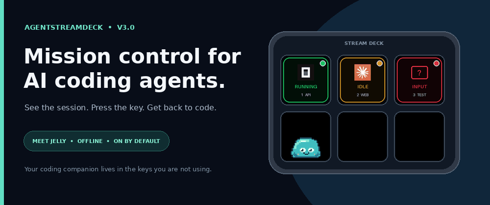
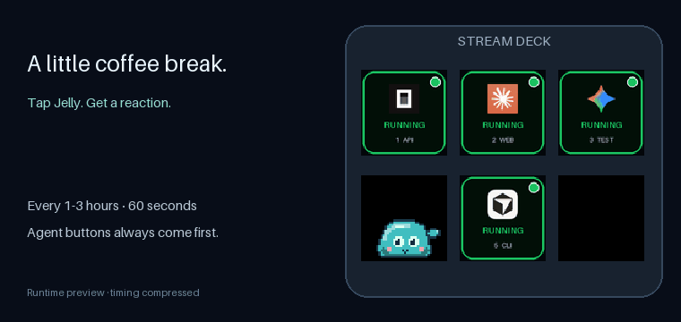
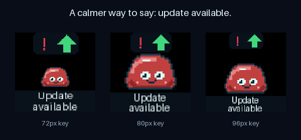

# AgentStreamDeck

**Your AI agents, one glance away.** See which session is working, waiting or needs you—then press a Stream Deck key to jump back in.

<p align="center">
  
</p>

[](https://github.com/darkmatter2222/AgentStreamDeck/actions/workflows/ci.yml)
[](https://pypi.org/project/agentstreamdeck/)
[](pyproject.toml)
[](LICENSE)

[Get started](#get-started) · [Supported agents](#supported-agents) · [Customize](#make-it-yours) · [Documentation](docs/README.md) · [Watch the demo](https://www.youtube.com/watch?v=NTWLbLbJiO0)

> ☕ Enjoying AgentStreamDeck? [Buy Ryan a Coffee](https://buymeacoffee.com/j6oiubzfnh) to support development, hardware testing and documentation. A [GitHub star](https://github.com/darkmatter2222/AgentStreamDeck) helps other developers find it, too.

## Keep your attention on the work

Running several coding agents means several windows to check. AgentStreamDeck gives each session a physical key with its project label, agent icon and live status.

- **Know where you're needed.** Animated status keys distinguish work in progress, idle sessions and supported input requests.
- **Get back with one press.** Focus the session's Windows window; minimized windows are maximized and brought forward.
- **Keep your usual workflow.** Launch your CLI or editor normally after installing its integration. No special launcher, Elgato plugin or MCP server required.
- **Give spare keys some personality.** Jelly, an offline companion, plays on unused buttons and reacts when you tap him.

The hero above uses the actual renderers on a simulated deck. [The video demo](https://www.youtube.com/watch?v=NTWLbLbJiO0) shows the OpenCode workflow on hardware.

## Get started

### 1. Check your setup

| You'll need | Supported setup |
|---|---|
| Stream Deck | Mini (6 keys), Original/MK.2 (15), or XL (32); one device per broker |
| Python | 3.11 or newer |
| Node.js | 20 or newer for hook adapters |
| Desktop | Windows for USB control and window focus; Linux supports the broker and device rendering, but not desktop focus |

Plug in your deck and **quit the Elgato Stream Deck app from the system tray** so AgentStreamDeck can use it.

### 2. Install and start

```powershell
python -m pip install --upgrade agentstreamdeck
python -m ocdeck install
```

The second command registers and starts the background broker for your user, including startup at login. It also installs the OpenCode plugin if `opencode` is on PATH. No repository checkout is needed. The commands use `python -m` so a missing Scripts folder on PATH won't get in your way.

### 3. Connect your agent

For Claude Code, run this from a project you want to monitor:

```powershell
cd C:\Projects\MyApp
python -m ocdeck harness-install claude
claude
```

For another agent, choose its profile below. Repeat hook installation for each project you want to monitor. Existing unrelated hooks are preserved. **OpenCode uses its global plugin**, so just launch `opencode` after step 2; if it wasn't on PATH during setup, run the install command again once it is.

| Agent | Project hook profile | What it can report |
|---|---|---|
| OpenCode | Global plugin; no project profile needed | Activity, permission requests and structured questions |
| Claude Code | `claude` | Activity, identified questions; permission counts may be unknown |
| Codex CLI | `codex` | Activity and observed approval state; counts unknown |
| GitHub Copilot CLI | `copilot-cli` | Activity only |
| Copilot in VS Code | `copilot-vscode` | Activity only; preview integration |
| Gemini CLI | `gemini` | Activity and recognized permission notifications |
| Cursor CLI | `cursor` | Activity only; Cursor desktop isn't included |

For example, use `python -m ocdeck harness-install codex`, then review and trust the hooks in Codex using `/hooks`. [Agent-specific setup and coverage](docs/HARNESSES.md) explains prerequisites and limitations.

### 4. Try a key

Start an agent in the configured project, send it a task and watch its key change. Press the key to return to that session. Use a separate OS window for each monitored session; several tabs in one terminal window can make focus ambiguous.

```powershell
python -m ocdeck status
```

Need more detail? [Installation guide](docs/PLUGIN-FIRST.md) · [Troubleshooting](docs/TROUBLESHOOTING.md) · [Remote and WSL setups](docs/REMOTE-AND-WSL.md)

## Supported agents

The integrations above share the same deck, but their event coverage differs. These are the default visual signals:

| Key | Meaning |
|---|---|
| Green moving ring | Agent reports work in progress |
| Amber breathing glow | Agent reports idle |
| Red attention indicator | Identified input request or observed approval state |
| Amber `LINK ?` | Connection or state is unknown |

**Activity-only integrations can still look busy while waiting for approval.** A green key doesn't guarantee that no input is needed. Input counts appear only when the integration supplies enough information.

Pressing an agent key requests window focus. It never types a reply or approves a tool. Windows can restrict foreground activation; the status output includes the last focus result for diagnosis.

## Make it yours

Choose recognizable agent logos, project labels, layouts, color palettes and animation styles. Apply a preset across the deck or give individual keys their own look.


```powershell
python -m ocdeck appearance --preset neon --layout harness
```

Restart the broker after saving appearance changes. You can preview changes before saving, export a favorite look, or turn animation off. Sound alerts and Windows notifications are optional and off by default.

[Appearance gallery and settings](docs/APPEARANCE.md) · [Configuration, alerts and maintenance](docs/CONFIGURATION.md)

## Meet Jelly

Jelly makes a home on your spare buttons. He stretches, dances, naps and changes mood with the rhythm of your coding sessions. Tap him for a wobble, cheer or little “Boop!” His thoughts and personality run offline using session activity metadata, without reading your prompts or source code.



With **two free keys**, Jelly can point to a steaming coffee cup and ask “Coffee?” at a random interval of **1–3 hours**. The invitation lasts **60 seconds**; pressing the cup opens [Ryan's Buy Me a Coffee page](https://buymeacoffee.com/j6oiubzfnh) and dismisses it. The preview speeds up the wait. Agent controls always take priority.

Prefer a quieter deck? Set `"jelly": {"coffee": false}` to disable coffee invitations or `"jelly": {"enabled": false}` to turn Jelly off. Merge these preferences into your existing configuration and restart the broker.

[Jelly's personality, animations and settings](docs/JELLY.md)

## Stay up to date

When an update is available, Jelly settles down with rainbow colors, a red exclamation point, a green upgrade arrow and **“Update available”** beneath him. He moves at most once every 30 seconds so you can read it.



**Press the marked Jelly to install the detected update and restart the broker.** Checking for updates never installs anything by itself. You can also update with:

```powershell
python -m pip install --upgrade agentstreamdeck
```

A running broker with upgrade monitoring automatically restarts after the new package finishes installing. Use the same Python environment as the broker. First-time setup still needs `python -m ocdeck install`; older installations may need one restart to enable monitoring. [Upgrade details and opt-outs](docs/CONFIGURATION.md#pip-upgrades-restart-the-broker-automatically)

[Release notes](https://github.com/darkmatter2222/AgentStreamDeck/releases) · [Upgrading from AgentDeck](docs/RENAMING.md)

## Need a hand?

```powershell
python -m ocdeck doctor --no-device --json
python -m ocdeck report --output agentstreamdeck-report.zip --lines 200
```

Start with the [troubleshooting guide](docs/TROUBLESHOOTING.md). On Windows, configuration and logs live under `%USERPROFILE%\.opencode-deck` unless you've set `OCDECK_HOME`; the main log is `broker.log`. Review diagnostic reports before sharing them in a [GitHub issue](https://github.com/darkmatter2222/AgentStreamDeck/issues).

The controller runs locally. Online update checks can be disabled with `"check_updates": false`. [Configuration and removal instructions](docs/CONFIGURATION.md) cover alerts, startup, backups and uninstalling integrations.

## Build with us

Adapter improvements, bug reports and hardware testing are welcome. See [CONTRIBUTING.md](CONTRIBUTING.md) for development setup, [the architecture](docs/ARCHITECTURE.md) for the internals, and [the documentation index](docs/README.md) for deeper guides.

CI tests Windows and Ubuntu with Python 3.11/3.13, including package installation and upgrade behavior. USB hardware and interactive window focus also need real desktop testing; [verification details](docs/TEST-RESULTS.md) distinguish that from automated coverage.

Licensed under [Apache 2.0](LICENSE). Agent names and logos belong to their respective owners; see [third-party notices](THIRD-PARTY.md).
