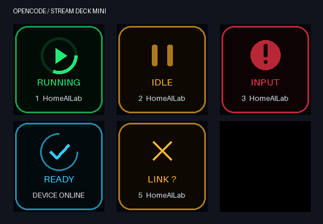
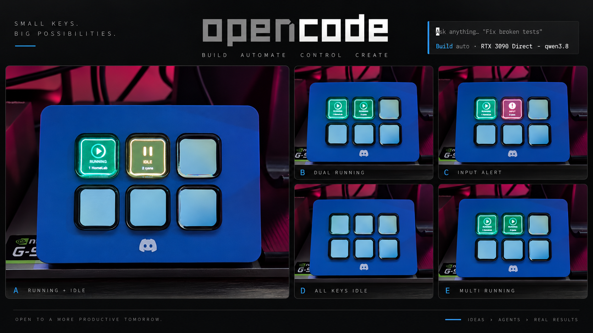
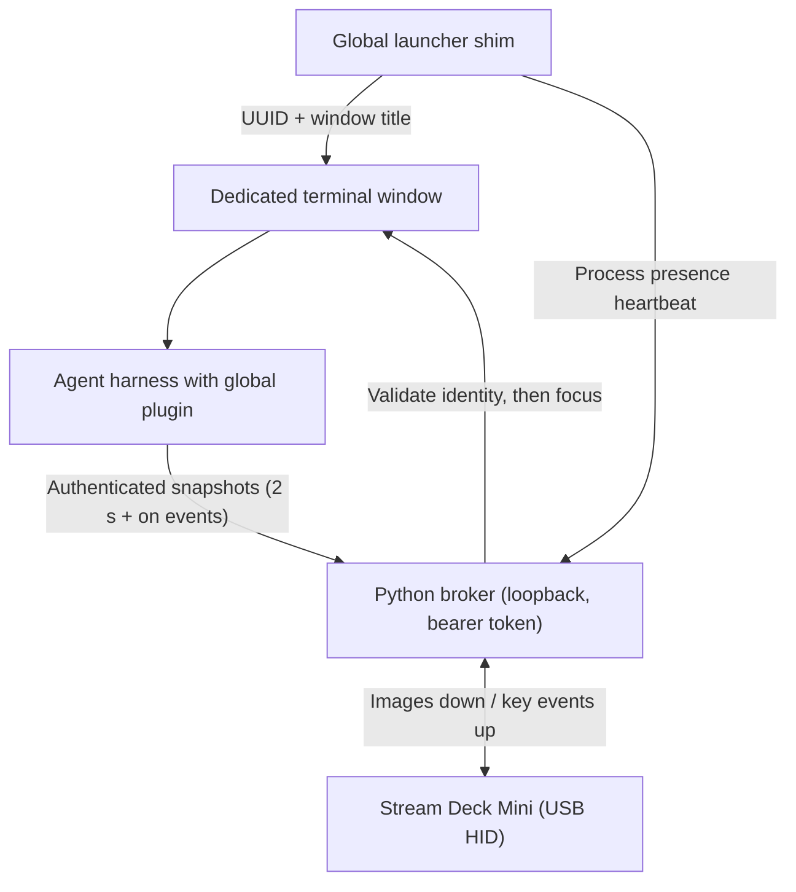

# OpenCode Deck

**Your Stream Deck Mini, turned into a live mission control for your coding agents.**

Six physical keys. Up to six agent terminal instances. One glance tells you which agent is working, which is idle, and which one needs *you* — then a single press brings that exact terminal to the foreground. No clicking, no hunting through windows, no MCP, no Elgato plugin: just direct USB HID and a tiny authenticated local broker.



> The preview places all states on six keys simultaneously so you can see the artwork. In real use, READY appears on key 1 only when zero instances are running.



| Condition | Key appearance |
|---|---|
| Device online, no instances | Cyan animated **READY** on key 1; five black keys |
| Running or retrying | Green moving ring |
| Idle | Amber breathing glow |
| Permission or structured question pending | Red pulsing attention icon |
| Telemetry unavailable / stale (>10 s) | Amber **LINK ?** |
| Empty slot | Black; press does nothing |

## Why it exists

When you run several agents at once, the terminal becomes a black box: *is it still working? Did it stop? Is it waiting for my approval?* OpenCode Deck projects each instance onto a physical key:

- **Green** = the agent is working (busy *or* auto-retrying).
- **Red** = it is blocked on a human: a permission prompt or a structured question. Nothing is ever auto-approved.
- **Amber** = idle, waiting for your next prompt.
- **Press the key** = the matching terminal window is focused, verified against the actual foreground window. No keystrokes, no state changes, no guessing.

Slots are stable: closing an instance frees its key without shuffling the others. A seventh instance waits off-deck and takes the first vacancy in registration order.

## OpenCode and additional harness adapters

OpenCode has its existing global plugin. This testing branch adds native hook
adapters for **Claude Code, GitHub Copilot CLI, GitHub Copilot in VS Code, Gemini
CLI, and Cursor CLI**, all sharing the same six keys. The core broker, device,
artwork and focus protocol are unchanged.

Start with [docs/HARNESSES.md](docs/HARNESSES.md) for installation, Windows BAT
launchers, capability differences and a live test checklist. These new adapters
are implemented and fixture-tested; live harness loading and Windows hardware
remain unverified. Approval visibility varies by harness, and VS Code uses an
isolated test profile. Existing OpenCode installation instructions below still apply.

New integrations belong in the adapter layer; see [CONTRIBUTING.md](CONTRIBUTING.md).

## Requirements

| Thing | Minimum | Notes |
|---|---|---|
| OS | Windows 10 or 11 | Native Windows user session (not WSL, not a service account) |
| Terminal | Windows Terminal | `winget install -e --id Microsoft.WindowsTerminal` |
| Python | 3.11+ (64-bit) | `python --version` to check; `winget install -e --id Python.Python.3.13` to install |
| Agent harness | **OpenCode** (installed and on PATH) | Verify with `opencode --version`. Additional harnesses: see `docs/HARNESSES.md` |
| Hardware | **Elgato Stream Deck Mini (6 keys)** | Must be the Mini — the whole design is six stable slots. `ocdeck devices` lists what is detected |
| Elgato app | **7.1+ (7.2+ recommended)** | 7.1 introduced the per-device "Enabled" toggle you'll use below |
| Internet | Once | For `pip` dependencies during install |
| Node | 20+ | Only for the JavaScript test suite; OpenCode runs the plugin itself |

No GPU, no model, no new provider or permission config. Nothing about your existing setup is replaced.

## Getting started

Two paths. **Path A** is the fun one: hand the repo to your agent. **Path B** is the same thing, done by hand, step by step. Either way, there are exactly two things *you* must personally do:

> **1. Disable the Mini in the Elgato app** (details below — this is the #1 setup failure).
> **2. Restart your agent harness** after install, so the new plugin loads.

### The one setup step that matters: take the Mini out of Elgato's hands

This app talks to the Mini **directly over USB HID**. If Elgato's own software still "owns" the device, the two will fight — images flicker, keys go blank, presses get lost.

1. Open the **Elgato** desktop app (Elgato Hub / Elgato Stream Deck).
2. Go to **Devices**.
3. Find your **Stream Deck Mini** in the device list.
4. Turn its **Enabled** toggle **OFF** (this per-device toggle was added in Elgato 7.1 — that's why 7.2+ is recommended).
5. That's it. Elgato can stay installed and running; it just must not own *this* device. Close any other scripts or apps that also write to the Mini.

The Mini keeps working normally — *this* app simply becomes its driver. Re-enable it in Elgato only if you're uninstalling.

### Path A — let your AI agent install it (recommended)

Open your agent — today that means **OpenCode** — and give it this prompt:

```text
Clone https://github.com/darkmatter2222/AgentDeck to a permanent directory (not a temp
folder — the install is editable and stays in place). Read docs/QWEN-HANDOFF.md and
docs/FIRST-RUN.md first, then install OpenCode Deck on this machine.

Before running scripts\Install.ps1, ask me to confirm that I have disabled my
Stream Deck Mini in Elgato > Devices (per-device "Enabled" toggle OFF), and that
Elgato 7.1+ is installed.

Then: run scripts\Install.ps1; open a FRESH terminal and verify Get-Command opencode
points to .opencode-deck\bin\opencode.cmd and ocdeck status shows device.online true
and device.mock false; run scripts\Test.ps1; then walk me through the physical
acceptance checks in docs/FIRST-RUN.md one by one. Finally, tell me to restart my
OpenCode sessions so the global plugin loads, and record what you verified in
docs/TEST-RESULTS.md.
```

That's the whole install for you: **one prompt, two personal actions** (disable the Mini above, restart your sessions when asked). The agent handles clone, Python/venv, PATH, scheduled task, plugin, and verification.

### Path B — by hand, step by step

Work through these in order. Each step tells you exactly what "done" looks like.

**Step 1 — Check your prerequisites (2 minutes).** Open PowerShell and run these four checks:

```powershell
python --version     # need 3.11 or newer
wt --version         # Windows Terminal; if missing: winget install -e --id Microsoft.WindowsTerminal
opencode --version   # your harness; if missing, install OpenCode from https://opencode.ai
Get-Command elgato -ErrorAction SilentlyContinue   # just orienting yourself; the app is installed normally
```

Any check that fails? Install that one thing (links in the Requirements table), then re-run it. Don't move on until all three versions print.

**Step 2 — Disable the Mini in Elgato.** See the section above. Toggle OFF, verify it's off, move on.

**Step 3 — Get the code somewhere permanent.**

```powershell
git clone https://github.com/darkmatter2222/AgentDeck
cd AgentDeck
```

*(No git? Download the ZIP from the repo's "Code → Download ZIP" and extract it somewhere you won't delete it.)* The install is **editable** and the plugin imports source files from this folder — so don't move, rename, or delete it later. `C:\Tools\AgentDeck` or a repos folder are both fine.

**Step 4 — Run the installer.**

```powershell
powershell -NoProfile -ExecutionPolicy Bypass -File .\scripts\Install.ps1
```

What it does, in one breath: creates a private venv under `%USERPROFILE%\.opencode-deck`, pip-installs the four pinned dependencies, records your original `opencode` executable, installs the global plugin into your OpenCode config, drops a few small `.cmd` shims on your user PATH, and registers the `\OpenCode Deck` Task Scheduler task (starts hidden at your logon, auto-restarts on failure). **No admin required.** If Task Scheduler complains about access rights, re-run PowerShell elevated **as the same user** — not as another admin or SYSTEM.

**Step 5 — Open a FRESH terminal** (PATH changes only apply to new shells). Then verify:

```powershell
Get-Command opencode    # must show ...\.opencode-deck\bin\opencode.cmd
ocdeck status           # must show "device": { "online": true, "mock": false }
```

If `Get-Command opencode` shows something else, a shell alias or machine PATH entry is outranking the shim — use `oc` / `ocdeck launch` for managed windows, or fix the shadowing entry.

**Step 6 — The first real moment.** Run `opencode` from a project directory. A dedicated terminal window opens, and **key 1's READY turns amber**. Send a prompt — the key goes **green**. Ask it to use a tool that needs approval — it goes **red**. Press that physical key from any other app — the right window comes to the front. That's the whole product.

**Step 7 — Prove it to yourself.** Run `scripts\Verify-Windows.ps1`, then work through the physical checklist in [docs/FIRST-RUN.md](docs/FIRST-RUN.md) (six slots, seventh overflow, minimize + focus, reboot → logon → READY).

**Troubleshooting in 30 seconds:** key is black but the app is running → check that Elgato doesn't own the Mini (Step 2) and that `ocdeck status` shows `online: true`. `LINK ?` on a key → telemetry stale; the deck deliberately shows *unknown* instead of a confidently wrong idle — check `ocdeck status` and OpenCode's own logs. Everything is in `.opencode-deck\broker.log`.

## How it works (the short version)



- **Broker** (`ocdeck/`): one process owns the Mini, a registry of six slots, and an authenticated `127.0.0.1` API on an OS-assigned port published via an atomic `discovery.json`.
- **Plugin** (`plugins/`): a dependency-free harness plugin reduces runtime events to `{status, pending}` and heartbeats complete snapshots, so a broker restart self-heals with one re-register.
- **Launcher** (`ocdeck/launcher.py`): each managed launch gets a dedicated Windows Terminal window with a unique title token, giving focus an unambiguous target.
- **Identity**: PIDs are paired with exact process creation timestamps — a reused PID can never steal a key.

Full detail in [`docs/ARCHITECTURE.md`](docs/ARCHITECTURE.md) and the API in [`docs/API.md`](docs/API.md).

## CLI reference

| Command | What it does |
|---|---|
| `opencode …` | Global shim: interactive launches become managed windows; `run`, `serve`, `web`, `--version`, etc. pass through untouched |
| `oc …` / `ocdeck launch …` | Explicitly launch a managed instance (use these if a shell alias or machine PATH outranks the shim) |
| `ocdeck status` | Broker health, device state, all six slots, overflow, last focus result |
| `ocdeck stop` | Graceful broker shutdown |
| `ocdeck focus 1..6` | Synthetic focus request for a slot (one-based); marks the result `synthetic: true` |
| `ocdeck devices` | List detected Stream Deck Minis (serial, product ID) |
| `ocdeck hardware-check` | Standalone six-key physical diagnostic (stop the broker first) |
| `ocdeck broker [--mock]` | Run the broker in the foreground (or with a mock device) |
| `ocdeck preview` | Render the animation preview GIF |

## Recommended patterns

1. **Use the managed launcher for anything you want on the deck.** `opencode` (or `oc`) from a project directory is the primary path. Plain unmanaged launches still register via the global plugin, but exact window focus is only *guaranteed* for managed windows.
2. **One instance = one dedicated terminal window.** The deck assumes one independent agent runtime per managed terminal. Several TUI tabs sharing one server window can't be separated by design.
3. **Keep Elgato disabled for the Mini.** Two USB owners is the #1 breakage mode. Any other scripts writing to the Mini too.
4. **Trust the red key, not your memory.** Red means an unresolved request ID exists — the monitor doesn't interpret prose questions.
5. **Watch for LINK ?.** It means telemetry is stale or the harness snapshot failed — the deck deliberately shows *unknown* instead of a confidently wrong idle.
6. **Restart the broker task after editing `config.json`** (fps, brightness, animations, ready, serial).
7. **Restart your agent sessions after installing** so the global plugin loads in new processes.
8. **Uninstall with `scripts/Uninstall.ps1`** — it removes only what the installer owns (task, plugin entry, PATH) and keeps logs/config/venv. Then re-enable the Mini in Elgato if you want it back.
9. **Don't move the source folder after installing** — the plugin entry imports `.mjs` files by absolute path from it.

### Configuration

`.opencode-deck\config.json`:

```json
{"fps": 10, "brightness": 45, "animations": true, "ready": true, "serial": null}
```

`fps` is capped at 15. Set `animations: false` for static images, lower `fps` to reduce USB load, `ready: false` for six black keys when empty, and `serial` (from `ocdeck devices`) when multiple Minis are present.

## Scope and boundaries

Global **for one native Windows user and one harness config home**, across any project directory. Not yet: WSL/containers/SSH (relay designed in `docs/REMOTE-AND-WSL.md`, not implemented), multiple tabs/panes in one window, macOS/Linux, and harnesses outside the implemented adapter list. New hook integrations require the managed launchers described in `docs/HARNESSES.md`. The broker stays on `127.0.0.1` — it is a trusted local protocol, not a LAN service.

## Uninstall

```powershell
.\scripts\Uninstall.ps1
```

Removes the scheduled task and the managed plugin entry, and takes the launcher directory out of your user PATH. Logs, config, and the venv are retained. If you opted into TUI mode, also remove its URI from `tui.json` as the uninstaller prints. Re-enable the Mini in Elgato Preferences > Devices if you want Elgato back.

## For AI agents

If an agent is taking this on, the single best entry point is **[`docs/QWEN-HANDOFF.md`](docs/QWEN-HANDOFF.md)** — a step-by-step deployment and verification plan with explicit completion criteria and known investigation areas. Supporting docs:

- `docs/FIRST-RUN.md` — physical acceptance tests on the owner's PC
- `docs/ARCHITECTURE.md` / `docs/API.md` — implementation and broker protocol
- `docs/REMOTE-AND-WSL.md` — design boundaries + extension plan for WSL/SSH/containers
- `docs/RESEARCH.md` — prior art and rejected alternatives
- `CONTRIBUTING.md` — where new harness adapters belong (and what not to touch)

Run the suite with `scripts\Test.ps1` (Python unittest + Node 20 `node --test`). The optional live-runtime end-to-end fixture is `tests\live_opencode.py` (set `OPENCODE_TEST_BIN`); it uses a local deterministic model — no cloud provider or hardware needed.

## Layout

```
ocdeck/       Python broker, HID adapter, focus, launcher, artwork, CLI
plugins/      Harness adapters: core.mjs (shared), server.mjs (OpenCode default), tui.mjs (OpenCode opt-in)
scripts/      Install.ps1, Uninstall.ps1, Test.ps1, Verify-Windows.ps1, Run-OpenCode.ps1
tests/        Python + Node test suites and the optional live OpenCode fixture
docs/         architecture, API, first-run, research, verification, handoff
images/       README media
```

---

## Made for the desktop-first agent crowd

If you've ever stared at six terminals wondering which one needs you — this is the one. **A star would mean a lot** and helps others find it. Built a new harness adapter? [Open a PR](https://github.com/darkmatter2222/AgentDeck/pulls) — that's the whole roadmap. If it's wrong for your setup, [open an issue](https://github.com/darkmatter2222/AgentDeck/issues) with the output of `ocdeck status` and the failed step from `docs/TEST-RESULTS.md`.

<sub>Apache-2.0 · Python 3.11+ · Windows 10/11 · No build step, no MCP, no cloud</sub>
