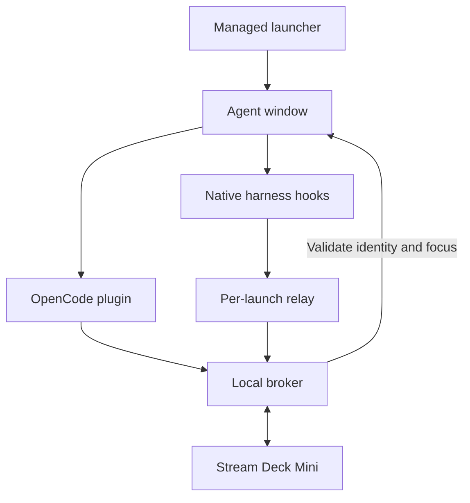

# AgentDeck

**Six Stream Deck Mini keys for your coding agents: see activity, then press a key to focus the right window.**

AgentDeck connects OpenCode, Claude Code, GitHub Copilot CLI, Copilot in VS Code,
Gemini CLI and Cursor CLI to one local controller. Each managed launch gets a stable
key. A seventh launch waits for a vacancy; closing one does not shuffle the others.
The controller uses direct USB HID, with no Elgato plugin or MCP server.


The preview shows every state together. In normal use, READY appears only when no
agents are registered. Windows hardware and native harness acceptance gates are
tracked in [the verification record](docs/TEST-RESULTS.md).

## Demo video

[](https://www.youtube.com/watch?v=NTWLbLbJiO0)

[Watch on YouTube](https://www.youtube.com/watch?v=NTWLbLbJiO0). The original demo
shows the OpenCode workflow; additional adapters have the coverage described below.


## Choose your harness

| Harness | Integration / launch | Pending-input coverage |
|---|---|---|
| OpenCode | Global server plugin; `opencode` shim or `oc` | Permission and structured-question IDs; SDK reconciliation when available |
| Claude Code | Project hooks; `Launch-Claude.bat` | Identified `AskUserQuestion` calls; permission hooks show unknown instead of an invented count |
| GitHub Copilot CLI | Project hooks; `Launch-Copilot.bat` | Activity only; approvals may still appear running |
| Copilot in VS Code | Project hooks; `Launch-Copilot-VSCode.bat` | Activity only; isolated editor profile, preview integration |
| Gemini CLI | Project hooks; `Launch-Gemini.bat` | Activity; recognized permission notifications show unknown |
| Cursor CLI (`agent`) | Project hooks; `Launch-Cursor.bat` | Activity only; Cursor desktop integration is not included |

All five added hook adapters are implemented and fixture-tested. Live loading in
each native harness, Windows scripts, editor focus and physical hardware still
need local validation. A non-red key does **not** prove that no approval is waiting.
See [adapter details](docs/HARNESSES.md) for lifecycle and missed-event limitations.
Codex CLI, Aider and cloud/remote agents are not implemented in this release.

| Condition | Key appearance |
|---|---|
| Device initialized, no registered launches | Cyan **READY** on key 1; five black keys |
| Reported busy or retry | Green moving ring |
| Reported idle | Amber breathing glow |
| Identified unresolved input request | Red pulsing attention icon |
| Unknown or snapshots stale for more than 10 seconds | Amber **LINK ?** |
| Empty slot | Black; pressing it does nothing |

A key press requests focus only. It never types, approves a tool, answers a question,
or changes an agent's state. Windows can deny foreground activation; inspect
`lastFocus` in `ocdeck status` and verify physical behavior on your desktop.

## Requirements

| Component | Requirement |
|---|---|
| Desktop / hardware | Windows 10 or 11, interactive user session, six-key Stream Deck Mini |
| Terminal | Windows Terminal (`wt.exe`) for dedicated managed windows |
| Python | 3.11+; 64-bit recommended |
| Node.js | 20+ on PATH for every new hook adapter and for JavaScript tests |
| Harness | The desired CLI/editor installed; its native hooks enabled and supported |
| Elgato | Release the Mini using its per-device Enabled toggle; close other Mini controllers |
| Installation | Network access for Python dependencies; permanent source directory |

The original `scripts/Install.ps1` requires OpenCode and installs its global plugin,
command shims and per-user logon task. Other adapters do not require OpenCode:
use the [foreground broker tutorial](docs/TUTORIALS.md#fresh-install-without-opencode).
Linux/macOS can run mock/status tests; Windows desktop focus is not implemented there.

The project targets the compact six-key Mini. Full-size Stream Deck models are not
supported by the current device selection and six-slot layout.

## Get started

**Release the Mini first:** in Elgato's device preferences, turn off Enabled for
this Mini. Leave other devices enabled if desired. Close any old controller scripts.
Two applications writing to the same device cause flicker and unreliable input.

Choose the path that matches your setup:

- [Existing AgentDeck installation: add a harness](docs/TUTORIALS.md#existing-install-add-a-harness)
- [Fresh install with OpenCode and automatic logon startup](docs/TUTORIALS.md#fresh-install-with-opencode)
- [Fresh install without OpenCode: foreground broker](docs/TUTORIALS.md#fresh-install-without-opencode)
- [Copilot in VS Code: isolated editor setup](docs/HARNESSES.md#copilot-in-vs-code-preview)
- [Physical first-run acceptance](docs/FIRST-RUN.md)

For an existing install, keep this checkout at `C:\Tools\AgentDeck` (or substitute
your actual permanent location). In PowerShell:

```powershell
C:\Tools\AgentDeck\scripts\Install-Harness.ps1 -Profile claude -Project C:\Projects\MyApp
C:\Tools\AgentDeck\scripts\Install-Harness.ps1 -Profile copilot-cli -Project C:\Projects\MyApp
cd C:\Projects\MyApp
C:\Tools\AgentDeck\scripts\Launch-Claude.bat
C:\Tools\AgentDeck\scripts\Launch-Copilot.bat
```

Hooks are installed once **per software project**. The BAT launchers use the current
working directory; invoking them from the AgentDeck checkout would target that
checkout. Installation preserves unrelated settings, makes backups before changes,
and supports `-DryRun` and `-Remove`. Plain `claude` or `copilot` launches do not
attach to AgentDeck; use its managed launchers.

For AI-assisted setup, give your coding agent this instruction:

```text
Install AgentDeck from https://github.com/darkmatter2222/AgentDeck in a permanent
source directory. Read docs/QWEN-HANDOFF.md and docs/TUTORIALS.md. Use the setup path
for the harnesses I actually use, preserve my existing configuration, and verify
that the Mini has been released by Elgato before opening it. Run the automated
checks, then guide me through docs/FIRST-RUN.md and the harness-specific acceptance
steps. Record observed results separately from unverified hardware/runtime gates.
```

## How it works



The Python broker owns device access and six assignments. Both adapter paths use
`plugins/core.mjs` for authenticated snapshots, discovery, sequence numbers and
reconnection. Short-lived hook commands report metadata to a persistent relay,
which keeps one producer per launch and sends a full snapshot every two seconds.
Supervisor PIDs are paired with exact creation timestamps. A broker restart
restores reported state; confirmed process death releases a slot.

[Architecture](docs/ARCHITECTURE.md) · [Broker API](docs/API.md) · [Environment boundaries](docs/REMOTE-AND-WSL.md)

## Commands and configuration

| Command | Purpose |
|---|---|
| `opencode …` / `oc …` | Managed OpenCode launch after global installation; OpenCode utilities pass through the shim |
| `python -m ocdeck harness-install claude --project C:\Projects\MyApp` | Merge project hooks; add `--dry-run` or `--remove` as needed |
| `python -m ocdeck harness-launch --profile claude -- --resume` | Managed launch, forwarding arguments after `--` |
| `python -m ocdeck harness-launch --profile copilot-cli --executable C:\Tools\copilot.exe` | Select an executable explicitly |
| `ocdeck status` | Device health, six slots, overflow and last focus result |
| `ocdeck stop` | Stop the broker |
| `ocdeck focus 1` | Synthetic focus check for key 1; keys are numbered 1–6 |
| `ocdeck devices` | Detect supported Minis |
| `ocdeck hardware-check` | Physical diagnostic; stop the broker first |
| `ocdeck broker --mock` | Foreground broker with a mock device |
| `ocdeck preview` | Render the animation preview |

Use `python -m ocdeck` instead of `ocdeck` if no command shim is installed, with the
Python environment containing this checkout. `--current-window` on `harness-launch`
is useful for status tests; it does not promise exact terminal focus.

Broker settings live in `%USERPROFILE%\.opencode-deck\config.json` (or `OCDECK_HOME`):

```json
{"fps": 10, "brightness": 45, "animations": true, "ready": true, "serial": null}
```

Restart the broker after edits. FPS is capped at 15. Disable animations for static
images, disable ready for an empty black deck, or select a serial when multiple
Minis are connected. Compatibility names remain `ocdeck`, `.opencode-deck` and the
`OpenCode Deck` scheduled task; renaming the project does not rename installed state.

## Maintenance and troubleshooting

See [tutorials](docs/TUTORIALS.md) for upgrade and removal, and
[troubleshooting](docs/TROUBLESHOOTING.md) for LINK ?, missing keys, configuration,
permissions, focus, Node, broker restart and editor setup problems.

Remove project hooks **before** deleting their source files. `scripts/Uninstall.ps1`
only handles the original OpenCode task/server-plugin/PATH installation; it does
not find or remove project hooks. Retain `.agentdeck` receipts until each project
integration has been removed. Source paths are absolute: do not move the checkout
without reinstalling its integrations.

## Tests and contributor documentation

On Windows, run `scripts\Test.ps1`. On a configured development environment:

```text
python -m unittest discover -s tests -v
node --test tests/facts.test.mjs tests/harnesses.test.mjs
```

The tests use real subprocesses and loopback HTTP with fixture harness events and
mock hardware. They do not prove that a native agent loads hooks or that Windows
can focus a physical window. [TEST-RESULTS.md](docs/TEST-RESULTS.md) records evidence.

| Location | Contents |
|---|---|
| `ocdeck/` | Broker, device, focus, artwork, CLI and both launcher paths |
| `plugins/` | Shared transport and OpenCode server/TUI plugins |
| `plugins/harnesses/` | Hook profiles, normalization, relay, observer and installer |
| `scripts/` | Original installer, project-hook installer, BAT launchers and checks |
| `tests/` | Python/Node tests and optional live OpenCode fixture |
| `docs/` | [Documentation index](docs/README.md), tutorials, architecture and verification |

Read [CONTRIBUTING.md](CONTRIBUTING.md) before adding an adapter. Report issues with
harness/runtime versions, redacted `ocdeck status`, and the failed acceptance step.
Never include model credentials, broker tokens or hook connection descriptors.

Apache-2.0 · Python 3.11+ · Windows desktop · Local controller

## Button appearance and smoother animation

Choose Classic, Harness, or Minimal artwork, five palettes, two configurable text
lines, and per-button glow, pulse speed, and brightness. New installations target
24 FPS with 96-step animation cycles. [Customization guide and animated preview](docs/APPEARANCE.md).
