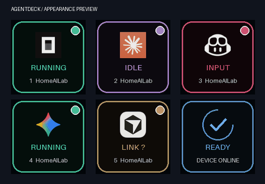

# Make the deck yours



Use the installed `ocdeck` command (or `python -m ocdeck` from the checkout).
Preferences are saved to `%USERPROFILE%\.opencode-deck\config.json` (or
`OCDECK_HOME`). Restart the AgentDeck broker after changing them. Existing
configuration, including an explicitly selected FPS, is preserved.

```powershell
ocdeck appearance --layout harness --theme aurora --effect glow --fps 24
ocdeck appearance --primary project --secondary status --no-show-slot
ocdeck appearance --slot 2 --theme ocean --secondary custom --custom-text "Code review"
ocdeck appearance --slot 3 --speed 0.7 --intensity 0.8 --brightness 0.65
ocdeck preview --layout harness --theme aurora --effect glow --output preview.gif
```

`ocdeck appearance` alone displays saved settings. Global changes are inherited
by buttons without a corresponding override. Remove a key from `buttons` in the
JSON file to restore inheritance for that key. Preview reads saved preferences;
explicit preview flags override them temporarily without saving changes.

| Setting | Choices |
|---|---|
| Layout | `classic` existing state artwork; `harness` official icon + upper-right state dot; `minimal` state glyph in a dot |
| Theme | `classic`, `aurora`, `ocean`, `accessible`, `mono`, `high-contrast` |
| Primary / secondary text | `status`, `project`, `alias`, `harness`, `detail`, `custom`, `none` |
| Effect | `breathe` border/status pulse; `glow` adds whole-image brightness breathing; `steady` freezes motion |
| Speed | 0.25–3; 1 is a two-second cycle |
| Intensity | 0–1; strength of brightness modulation |
| Brightness | 0.15–1; per-button rendered brightness |
| FPS | 1–30; new installations default to 24 |

Text is measured and shortened to fit by default, with optional clipped scrolling. Slot numbers can be hidden. Keep a status
text line if you want the clearest state identification, especially with the mono
palette or harness layout. `accessible` uses a distinct palette but does not
replace the need for textual state labels. Custom text is shared by both lines
when both select `custom`.

Official icon files are bundled for offline rendering; see [sources and
attribution](../THIRD-PARTY.md#harness-icons). Copilot CLI and VS Code share the
GitHub Octicons Copilot UI icon. Unrecognized harness IDs get a neutral question-mark
terminal, never another product's logo. Marks are not recolored by themes.

## Ten additional controls

All appearance flags below also work on `ocdeck preview` without saving settings.
Add `--slot 1` through `--slot 32` to save a per-button override with `appearance`.

| Control | Values / behavior |
|---|---|
| `--alias` | Up to 100 characters; replaces project text and is available as `--primary alias` / `--secondary alias`. Empty string restores the project name. Slot-based, not agent-based. |
| `--text-effect scroll` | Clips long text to its line, eases movement, and pauses at each end. Short text stays still. |
| `--text-effect shimmer` | Moving text highlight; `none` restores static text. |
| `--text-size` | `small`, `normal`, `large`; measured truncation still applies. |
| `--text-align` | `left`, `center`, `right`; scrolling overflow follows its own motion. |
| `--badge` | `dot`, `ring`, `pill`; Harness layout only. Ring and pill add non-color state cues. |
| `--border` | `solid`, `double`, `corners`, `none`. |
| `--background` | `solid`, `gradient`, `grid`. |
| `--logo-size` | `small`, `normal`, `large`; Harness layout only. |
| `--preset` | `studio`, `neon`, `focus`, `readable`, `marquee`. Resets visual fields at the selected scope, preserves alias/custom text, then applies explicit flags. |

JSON uses underscore field names, e.g. `text_effect`, `text_size`, `text_align`,
`logo_size`. Presets are a CLI convenience that writes the resulting fields;
there is no `preset` JSON field. The normal global / per-slot precedence applies.
Status and process identity never derive from aliases or other appearance settings.
Text uses the existing bundled ASCII font, replacing unsupported characters with ?.

`speed` controls icon and text motion together. Try `--speed 0.5` for long labels.
`effect: steady` and `animations: false` freeze text effects as well as icon motion.
`intensity` controls icon/glow pulsing; it does not control text shimmer.

```powershell
ocdeck appearance --slot 2 --preset marquee --alias "Backend review agent"
ocdeck appearance --slot 3 --preset neon --badge pill --logo-size large
ocdeck preview --preset studio --alias "Builder" --output studio.gif
```

## Advanced JSON example

Merge these fields into your existing config, retaining serial and other settings:

```json
{
  "fps": 24,
  "animations": true,
  "appearance": {
    "layout": "harness",
    "theme": "aurora",
    "primary": "project",
    "secondary": "status",
    "show_slot": false,
    "effect": "glow",
    "speed": 1,
    "intensity": 0.55,
    "brightness": 1
  },
  "buttons": {
    "2": {"theme": "ocean", "secondary": "custom", "custom_text": "Code review"},
    "6": {"layout": "minimal", "effect": "steady", "brightness": 0.6}
  }
}
```

Top-level `brightness` remains the device-wide hardware setting (0–100).
Appearance brightness is pixel dimming, not independent hardware backlighting.
`animations: false` disables all motion, including glow. Empty keys remain black.
A 96-step time-based cycle replaces the old 24-step cycle. Late frames are skipped
naturally; no queue of stale animation frames builds up. Actual FPS depends on USB
throughput and the number of active keys. Try 15 FPS if six active keys saturate
an older Mini. Hardware throughput and Windows appearance still need live testing.


## 2.1 additions

See [the 2.1 feature guide](NEXT.md) for larger decks, Codex, alerts, doctor/report,
appearance import/export, dry-run and complete integration uninstall.
