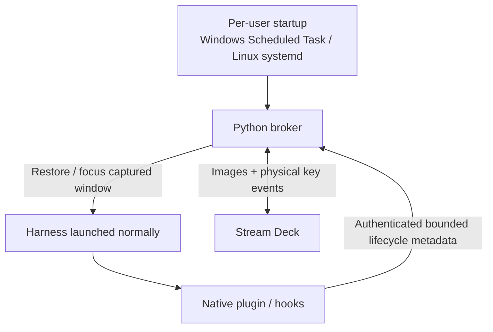
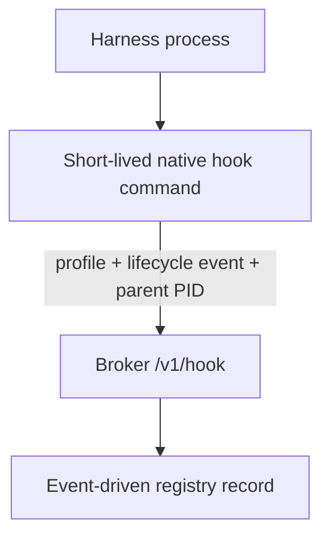

# Implementation architecture

[Project overview](../README.md) · [Documentation index](README.md)

AgentStreamDeck uses direct USB HID for the Stream Deck and native harness plugins/hooks for lifecycle metadata. No Elgato plugin, MCP server, or AgentStreamDeck-owned harness launcher is required for the normal path.

## Broker lifetime

`ocdeck install` is the explicit one-time operating-system setup step. A plain `pip install` does not silently create startup entries.

- Windows: a per-user **AgentStreamDeck Broker** Scheduled Task starts at interactive logon with limited privilege and restart settings.
- Linux: `agentstreamdeck.service` is installed as a systemd user service and enabled for the user's default target.
- Other platforms: the CLI reports the manual broker command rather than inventing an unsupported startup mechanism.

The broker writes `~/.opencode-deck/discovery.json` atomically after binding a loopback port. A separate per-user token authenticates local API clients. `common.py` implements discovery, authenticated requests, atomic state files, and PID + process-creation identity. `model.py` owns slot assignments behind a reentrant lock.

## Producer paths

### OpenCode

OpenCode uses the global AgentStreamDeck server plugin. It aggregates live session state, keeps unresolved permission/question IDs, and sends complete snapshots through the authenticated broker protocol. SDK reconciliation is used when the installed OpenCode API exposes the required snapshot methods.

### Native hook harnesses

Claude Code, Codex CLI, Copilot CLI, Copilot in VS Code, Gemini CLI, and Cursor CLI use project-native hook configurations installed with `ocdeck harness-install <profile>`.

The normal native-hook path is launcher-free:

`plugins/harnesses/profiles.mjs` maps native event names into a bounded normalized event. `hook.mjs` reads broker discovery/token files and posts the normalized event directly to `/v1/hook`. The broker derives a stable record from profile + native session ID, verifies the hook's parent process identity, and retains the last trustworthy event-driven state while that process remains alive.

Direct hook payloads do **not** forward prompts, commands, tool arguments, file contents, tool results, model responses, or transcripts.

The older `harness-launch`, `ocdeck start`, BAT launchers, and per-launch Node relay remain compatibility/testing paths. When `AGENTDECK_HOOK_BINDING` exists, the hook may still use that relay. They are not required for normal monitoring.

## Registry and state

The broker's functional states are off, idle, running, input, and unknown. READY is device-level appearance when every slot is empty; it never occupies a registry slot.

Process IDs are paired with creation timestamps to prevent PID-reuse mistakes. Conventional snapshot producers can become stale when no trustworthy snapshot arrives. Native direct-hook records are event-driven, so they do not become stale merely because no heartbeat arrived; confirmed process death still releases the record. Session-end hooks remove the record immediately when delivered.

Each slot reassignment increments its generation. Physical and synthetic focus requests include the last rendered assignment and generation. A stale assignment is rejected instead of focusing the wrong process.

## Physical Stream Deck input

The USB adapter uses the pinned `streamdeck` library with a custom transport backed by the pip `hidapi` wheel. It keeps the library's device-specific protocol, image conversion, rotation, and flip behavior rather than reimplementing packet formats.

Some Windows HID stacks return an unnumbered input report without the leading zero report-ID byte. The transport normalizes a report that is exactly one byte short by restoring that `0x00` prefix before handing it to the StreamDeck library. Unexpected report sizes are rejected instead of silently shifting key-state bytes.

The broker also monitors the StreamDeck library's input reader thread. If the reader dies or the deck disconnects, the device loop reconnects instead of continuing to render with a dead input path.

`ocdeck status` exposes `device.input_events` and `device.last_input`. These fields make the troubleshooting boundary explicit:

- counter does not move on a physical press: USB/HID input path problem;
- counter moves but focus fails: window mapping or Windows foreground-policy problem.

## Window mapping and focus

On Windows, native hook registration captures a visible top-level window owned by the harness process **or its nearest process ancestor**. This is important for Windows Terminal and wrapper scripts, because the CLI child process usually does not own the terminal HWND.

On key press, focus resolution prefers the captured HWND, then the legacy exact window token, then a unique nearest ancestor-owned visible window. The activation path restores minimized windows, tries `SetForegroundWindow`, and uses a bounded `AttachThreadInput` fallback that always detaches in `finally`. Success requires both foreground activation and keyboard focus.

There is no fallback that launches a process, sends Enter, approves tools, or guesses between ambiguous windows. Several tabs sharing one Windows Terminal process can be inherently ambiguous; for deterministic one-touch focus, keep one monitored harness per OS window.

Linux currently supports broker auto-start and monitoring but not desktop-window focus.

## Jelly rendering

`jelly_art.py` renders Jelly procedurally with Pillow. Gesture appendages are short rounded flippers attached to the body silhouette. Wave, point, up, down, scratch, cheer, and clap are bounded so they do not turn into long line-drawn stick arms or extend above the intended crown.

A regression renders every Jelly body pose across every gesture and animation step and checks the occupied bounds. The thought strip uses the clean antialiased UI font path introduced in v3.0.2.

Jelly only uses unassigned keys. Functional agent/system UI always wins. A slot assignment immediately evicts Jelly from that key on the next render tick.

## Updates

The broker's update worker checks the published `agentstreamdeck` package on PyPI at startup and every five minutes. A newer stable version places Jelly in update-alert mode with a persistent red `!`. Pressing the free key Jelly currently occupies is explicit approval to install that exact version. Detection alone never installs a package.

The update installer runs pip in the broker's current Python environment, then starts a detached broker restart after the old process exits. `check_updates: false` disables update checks.

## Appearance and rendering

`appearance.py` validates global and per-slot preferences shared by the CLI preview and device renderer. Motion uses bounded phases derived from monotonic time. Unchanged pixels skip USB writes but the presented slot assignment is still refreshed so focus remains correct when a slot is reused.

Harness icons are packaged locally. Registration names such as `copilot-cli` and `copilot-vscode` share the Copilot asset. Unknown harness identifiers receive a neutral terminal marker. Appearance aliases never change registry identity.

## Security boundaries

- Broker and optional legacy relay bind loopback only.
- Broker API uses a per-user bearer token.
- Browser Origin requests are refused.
- Native hook payloads are normalized and bounded before broker delivery.
- Hooks are observers by default. The opt-in Claude PermissionRequest path holds a native invocation for an explicit physical decision; see [deck controls](features/DECK-CONTROLS.md).
- No prompt/model transcript is required for monitoring.
- Physical key presses route the displayed action: agent focus, Jelly touch, an explicit package update, or the displayed coffee support link. They never answer an agent request.

See [API](API.md), [Harnesses](HARNESSES.md), [Plugin-first setup](PLUGIN-FIRST.md), and [Remote/WSL boundaries](REMOTE-AND-WSL.md).

## Related guides

[Repository source map](development/SOURCE-MAP.md) · [Developer setup](development/README.md) · [Privacy](features/PRIVACY.md)

[Project overview](../README.md) · [Documentation index](README.md) · [Feature hub](features/README.md) · [CLI reference](CLI.md)
