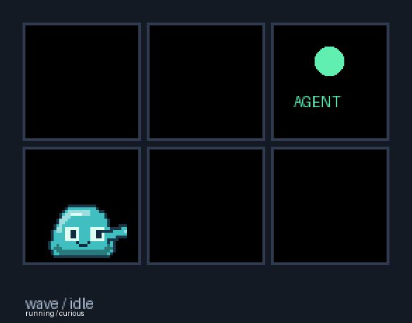

# Jelly: your coding companion

[Holiday costumes, live weather, seasons and world configuration](jelly/world.md)

[Project overview](../README.md) · [Documentation index](README.md)

[Back to the README](../README.md)


**Tap Jelly and he reacts.** A playful wobble, dance or cheer comes with a short
“Boop!”, “Ouch!” or another little response, even when ambient thoughts are off.
Agent-key focus is described in the [window switching guide](features/FOCUS.md).


Every **random 1–3 hours**, when **at least two buttons are unassigned**, Jelly
settles on one and points toward a steaming Buy Me a Coffee cup on the other.
He cycles through rainbow colors with **“Coffee?”** above his head. The pair can
be anywhere on the deck. After **60 seconds**, the invitation disappears.
Tap Jelly five times within a rolling 60-second window to start a coffee break
early, provided two keys are free and coffee invitations are enabled. The fifth
tap starts the invitation; it does not open a browser.

During any coffee invitation, tap Jelly or the cup to open [Ryan's support page](https://buymeacoffee.com/j6oiubzfnh)
in your default browser and dismiss the invitation immediately.

Agent controls always take priority: if an agent needs either key, the coffee
break ends. Each completed or dismissed break schedules a fresh 1–3 hour delay;
restarting the broker starts a new delay. Nothing opens without pressing Jelly or the cup during the invitation.
The cup artwork is bundled, so the animation needs no network access.

Set `"jelly": {"coffee": false}` to disable invitations, or
`"jelly": {"coffee_rainbow": false}` to keep Jelly's normal mood colors.
An available update's red `!` takes priority; tapping that marked Jelly still
installs the update. Preview timing above is compressed.

## Personality and settings


Jelly is a **companion enabled by default with offline personality and optional network-backed weather** living on the bottom edge of unused
buttons. He rests three native pixels above the floor, scoots and plays inside
his key, and occasionally crosses the bezel to a neighboring free button.


Jelly has **33 visible actions**, **33 body poses**, **14 hop styles**, **23 moods**, **four temperament
presets**, and **1,040 distinct authored thoughts**. Movement is continuous;
body poses are held deliberately and scaled with nearest-neighbor pixels.


Jelly's energy, nourishment, stimulation, workload, confidence and sociability
respond to session metadata. Sustained running activity nourishes and exercises
him while gradually using energy; quiet time restores energy and leads to
sleep. Busy sessions can make him overworked; bursts of changes can make him
overwhelmed. He responds by becoming quieter. There is no death, neglect penalty,
feeding obligation, streak, cloud model, prompt inspection or keystroke tracking.

His contextual thoughts appear above his head, inside his own button. Short text
holds still; longer text scrolls once, then disappears. A bounded recent-line
history avoids immediate repetition. Arrival, departure, reconnect, pending
input, explicit outcomes, and ambient thoughts have separate phrase categories.


**Functional agent and system UI always wins.** Jelly uses only unassigned `off`
keys; READY remains reserved. A new assignment immediately removes his body and
text on the next render tick, including during a jump. When an agent needs input,
he can follow a shortest route through free keys to a neighboring key, then scoot
and point toward it. If blocked, he points from where he is. Multiple pending
agents receive stable oldest-first attention; he never crosses occupied keys.



Jelly starts automatically in v3.0; no configuration is required. To update a source checkout:

```bash
git fetch origin
git switch main
git pull --ff-only
python -m pip install -e ".[dev]"
```

To customize Jelly, merge the following into `%USERPROFILE%\.opencode-deck\config.json` (or the
folder selected by `OCDECK_HOME`), then restart the broker:

```json
{
  "fps": 24,
  "animations": true,
  "jelly": {
    "enabled": true,
    "virtual_gap": 8,
    "behavior_seed": null,
    "hop_style": "mood",
    "personality": "balanced",
    "mood_colors": true,
    "needs": true,
    "reactions": true,
    "thoughts": "normal",
    "local_movement": "normal",
    "travel": "normal",
    "persistent": false,
    "coffee": true,
    "coffee_rainbow": true
  }
}
```

| Setting | Default | Options / behavior |
| --- | --- | --- |
| `enabled` | `true` | On by default; false disables Jelly. |
| `virtual_gap` | `8` | Integer 0–40 native pixels between key viewports. |
| `behavior_seed` | `null` | Optional integer for reproducible event/timing sequences. |
| `hop_style` | `classic` | One of the 14 styles below, or `mood` for mood-based selection. |
| `personality` | `balanced` | `balanced`, `mellow`, `curious`, `playful`. |
| `mood_colors` | `true` | Four-step palette transitions; false keeps the original turquoise. |
| `needs` | `true` | Activity-based needs and autonomous moods; false freezes needs. |
| `reactions` | `true` | Agent-state and successful-focus reactions; false disables these reactions. |
| `thoughts` | `normal` | `off`, `quiet`, `normal`, `chatty`. Approximate ambient cooldowns: 90/35/15 seconds. |
| `local_movement` | `normal` | `low`, `normal`, `high` relative local-action frequency. |
| `travel` | `normal` | `rare`, `normal`, `frequent` relative cross-key travel frequency. |
| `coffee` | `true` | Random 1–3 hour support invitation on two free keys, lasting up to 60 seconds. |
| `coffee_rainbow` | `true` | Cycle Jelly’s body colors during the coffee invitation. |
| `persistent` | `false` | Save bounded needs/mood/recent phrase IDs in `jelly-state.json`; no session data. |

Existing global `fps` remains authoritative (default 24; range 1–30).
`animations=false` disables Jelly entirely. Schema-version-1 appearance exports
remain compatible and omit Jelly's broker options; appearance imports preserve
them. Restart after changing config. To disable speech alone, set `thoughts` to
`off`; to disable Jelly, set `enabled` to false.

Hop styles: `classic`, `fluid`, `tiny`, `bunny`, `heavy`, `floaty`, `nervous`,
`excited`, `sleepy`, `running`, `sideways`, `tuck_roll`, `vault`, `careful_drop`.
`tiny` has a low arc; the separate `bounce` action performs an in-key hop.
`careful_drop` falls downward; an upward request uses classic motion.


The 20 new actions are scoot, crawl, roll, tiptoe, pace, edge peek, retreat, turn,
bounce, dance, spin, somersault, yawn, melt, reform, scratch, applaud, cheer, nod,
and head shake. All run locally without making a second device connection.

Regenerate previews and measurements without physical hardware:

```bash
python scripts/preview_jelly.py --benchmark
python scripts/preview_jelly_life.py
python scripts/preview_jelly_life.py --fps 30 --output docs/jelly-30
```

The output includes the sprite sheet, four directional hops, full-deck demo,
all-action gallery, all-pose gallery, mood palettes, thought scrolling, all-hop
comparison and an agent-reaction demo. Files live in [`docs/jelly/`](jelly/).
The ordinary `python -m ocdeck preview` remains the agent appearance preview.

Close Elgato's app and stop the existing broker before running:

```bash
python -m ocdeck broker
```

Use `python -m ocdeck broker --mock` for a hardware-free broker. From another
terminal, `python -m ocdeck status --json` reports `device.jelly_life` (mood,
action, selected hop and six needs) and `device.render_timing` (requested/effective
loop FPS, late ticks and composition/conversion/write milliseconds).

Optional persistence checkpoints once per minute and on normal close. Corrupt
state is ignored; restored energy is at least 85 and workload resets to zero,
so returning after a break is restorative. No elapsed-away decay is applied.
A Jelly failure disables the cosmetic subsystem; agent monitoring continues.

Native harness hooks forward explicit failure events and explicit `status:
"success"` on supported terminal stop events. Ordinary Stop/idle, interruptions,
and unknown connections never imply success or failure. Other integrations may
supply `outcome: "success" | "failure"` plus a stable `outcomeId` in their normal
snapshot. See the report for the precise contract and limitations.

**Physical acceptance remains pending.** Automated coverage includes 6/15/32-key
layouts; no physical Stream Deck is available here. The primary target is the
Mini. An 80px key uses 2× artwork; 72px keys retain crisp smaller 1× art. Real bezel
alignment, 24/30 FPS USB delivery and native harness payload support still need
physical validation. No new runtime dependency is introduced.

See the [engineering report](jelly/ENGINEERING.md) for implementation,
configuration, test coverage, measurements, and remaining hardware checks.

## Related guides

[Every companion setting](reference/JELLY.md) · [Animation catalog](jelly/README.md) · [Coffee interactions](features/COFFEE.md)

[Project overview](../README.md) · [Documentation index](README.md) · [Feature hub](features/README.md) · [CLI reference](CLI.md)
