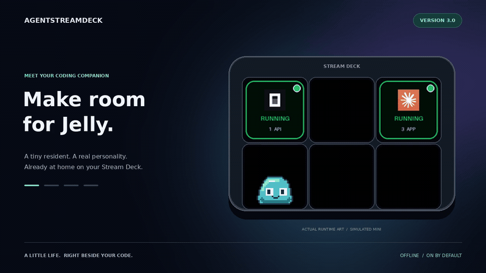
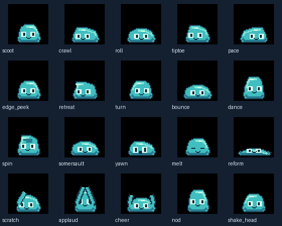
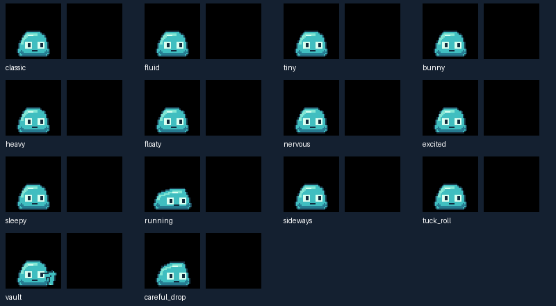
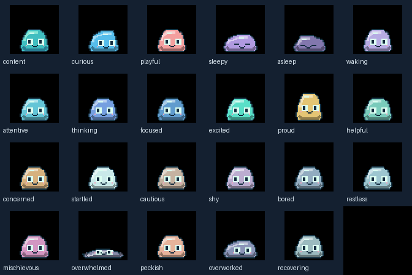
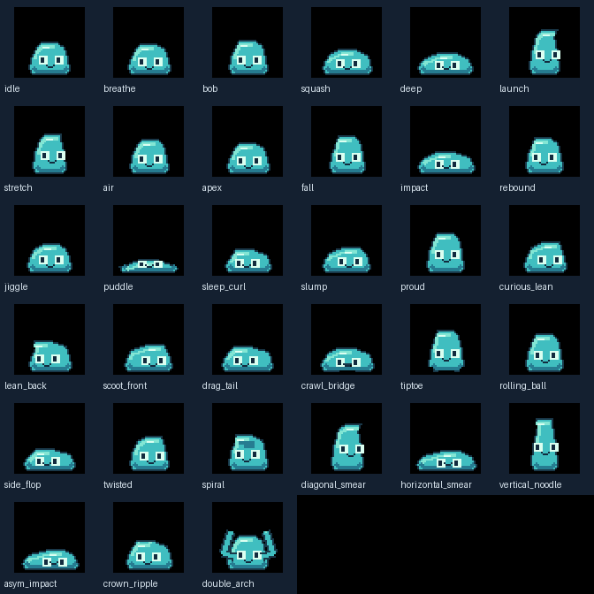
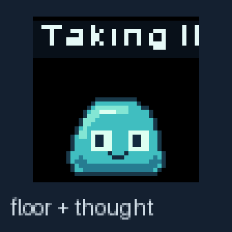

# Jelly animation catalog: actions, poses, moods, hops and thoughts

[Living-world setup and configuration](world.md) · [All 75 world scenes](world-catalog.md)

[Project overview](../../README.md) · [Documentation index](../README.md)

Browse Jelly’s actual local animation catalog and preview assets. These are generated renderer demonstrations, not photographs or proof of physical USB speed. The original hardware walkthrough is linked from the [media gallery](../GALLERY.md).

## Movement and actions

Jelly combines local floor actions with cross-key hops. He routes through free keys, never through assigned agent buttons. An agent assignment cancels any conflicting companion artwork on the next tick.

| Local action | Duration in seconds | Held pose sequence |
|---|---|---|
| `scoot` | 1.4 | `idle`, `scoot_front`, `drag_tail`, `idle` |
| `crawl` | 2.2 | `scoot_front`, `crawl_bridge`, `drag_tail`, `idle` |
| `roll` | 1.8 | `squash`, `rolling_ball`, `twisted`, `side_flop`, `idle` |
| `tiptoe` | 2.4 | `curious_lean`, `tiptoe`, `bob`, `tiptoe`, `idle` |
| `pace` | 3.6 | `scoot_front`, `drag_tail`, `twisted`, `scoot_front`, `idle` |
| `edge_peek` | 2.2 | `idle`, `scoot_front`, `curious_lean`, `curious_lean`, `idle` |
| `retreat` | 1.6 | `lean_back`, `drag_tail`, `scoot_front`, `idle` |
| `turn` | 1.2 | `idle`, `curious_lean`, `twisted`, `idle` |
| `bounce` | 1.3 | `squash`, `vertical_noodle`, `air`, `impact`, `idle` |
| `dance` | 2.4 | `proud`, `squash`, `twisted`, `rebound`, `jiggle`, `idle` |
| `spin` | 1.6 | `spiral`, `twisted`, `rolling_ball`, `crown_ripple`, `idle` |
| `somersault` | 1.8 | `squash`, `rolling_ball`, `side_flop`, `asym_impact`, `idle` |
| `yawn` | 2.5 | `slump`, `vertical_noodle`, `double_arch`, `breathe`, `idle` |
| `melt` | 3 | `breathe`, `slump`, `jiggle`, `puddle`, `puddle` |
| `reform` | 2.4 | `puddle`, `jiggle`, `rebound`, `proud`, `idle` |
| `scratch` | 2 | `curious_lean`, `twisted`, `curious_lean`, `idle` |
| `applaud` | 2 | `proud`, `double_arch`, `breathe`, `double_arch`, `idle` |
| `cheer` | 2 | `squash`, `double_arch`, `proud`, `rebound`, `idle` |
| `nod` | 1.4 | `proud`, `slump`, `proud`, `slump`, `idle` |
| `shake_head` | 1.5 | `idle`, `twisted`, `lean_back`, `twisted`, `crown_ripple` |

These twenty catalog actions extend base behaviors such as blinking, looking, waving, pointing and resting. Their durations are definitions for these sequences; autonomous selection, interruptions and movement can change what you observe.

## Every hop style

| Style | Prepare / flight / landing seconds | Arc multiplier |
|---|---|---|
| `classic` | 0.6 / 0.7 / 0.5 | 1.0 |
| `fluid` | 0.6 / 0.7 / 0.5 | 1.0 |
| `tiny` | 0.3 / 0.45 / 0.35 | 0.35 |
| `bunny` | 0.65 / 0.65 / 0.6 | 0.7 |
| `heavy` | 0.8 / 0.6 / 0.75 | 0.9 |
| `floaty` | 0.6 / 1.25 / 0.6 | 1.4 |
| `nervous` | 1.0 / 0.55 / 0.6 | 0.65 |
| `excited` | 0.65 / 0.65 / 0.6 | 1.3 |
| `sleepy` | 0.95 / 0.9 / 0.75 | 0.55 |
| `running` | 0.7 / 0.55 / 0.5 | 0.75 |
| `sideways` | 0.5 / 0.65 / 0.5 | 0.8 |
| `tuck_roll` | 0.6 / 0.7 / 0.8 | 1.1 |
| `vault` | 0.75 / 0.7 / 0.6 | 1.25 |
| `careful_drop` | 1.0 / 0.85 / 0.65 | 0.2 |

Choose a fixed hop_style or use mood to select based on state. The default is classic. Careful drop is directional: upward movement falls back to classic.

## Every mood

| Mood | Candidate local actions |
|---|---|
| `content` | `blink`, `nod`, `look_left` |
| `curious` | `edge_peek`, `scratch`, `look_up` |
| `playful` | `roll`, `spin`, `dance`, `somersault`, `bounce` |
| `sleepy` | `yawn`, `melt`, `rest` |
| `asleep` | `rest` |
| `waking` | `reform`, `yawn` |
| `attentive` | `look_right`, `nod` |
| `thinking` | `pace`, `scratch`, `look_up` |
| `focused` | `blink`, `nod` |
| `excited` | `cheer`, `bounce`, `dance` |
| `proud` | `applaud`, `cheer`, `nod` |
| `helpful` | `point_left`, `point_right` |
| `concerned` | `edge_peek`, `look_up` |
| `startled` | `retreat`, `bounce` |
| `cautious` | `tiptoe`, `edge_peek` |
| `shy` | `retreat`, `look_left` |
| `bored` | `melt`, `pace`, `reform` |
| `restless` | `pace`, `scoot`, `crawl` |
| `mischievous` | `tiptoe`, `turn`, `edge_peek`, `shake_head` |
| `overwhelmed` | `rest`, `yawn`, `blink` |
| `peckish` | `look_left`, `scoot` |
| `overworked` | `yawn`, `melt`, `blink` |
| `recovering` | `reform`, `yawn`, `nod` |

The six internal needs are energy, nourishment, stimulation, workload, confidence and sociability. Sustained coding activity feeds stimulation/nourishment while using some energy. Quiet time encourages rest; busy event bursts can make Jelly overwhelmed. The simulation has no death, neglect penalty or streak requirement.

## Body poses

`idle`, `breathe`, `bob`, `squash`, `deep`, `launch`, `stretch`, `air`, `apex`, `fall`, `impact`, `rebound`, `jiggle`, `puddle`, `sleep_curl`, `slump`, `proud`, `curious_lean`, `lean_back`, `scoot_front`, `drag_tail`, `crawl_bridge`, `tiptoe`, `rolling_ball`, `side_flop`, `twisted`, `spiral`, `diagonal_smear`, `horizontal_smear`, `vertical_noodle`, `asym_impact`, `crown_ripple`, `double_arch`.

## Authored thought vocabulary

| Category | Authored lines |
|---|---|
| `quiet` | 100 |
| `curiosity` | 100 |
| `play` | 100 |
| `running` | 100 |
| `input` | 80 |
| `success` | 80 |
| `concern` | 80 |
| `sleep` | 100 |
| `food` | 80 |
| `workload` | 100 |
| `greetings` | 56 |
| `resolved` | 20 |
| `failure` | 20 |
| `departures` | 17 |
| `reconnected` | 7 |

Total: **1,040 lines** across 15 categories. Thoughts are local authored text selected from context metadata, not generated by a language model. Short lines hold; long lines scroll once.

## Rendering and engineering

[Sprite sheet](jelly_sprite_sheet.png) · [Sprite metadata](jelly_sprite_sheet.json) · [Catalog JSON](catalog.json) · [Benchmark snapshot](benchmark.json) · [Engineering report](ENGINEERING.md) · [Update UX](UPDATE-UX.md).

The JSON/benchmark files are generated snapshots and should be regenerated after renderer changes. The source catalog and settings are authoritative. See [developer media commands](../development/README.md#regenerate-media) for reproduction.

## Related guides

[Jelly overview](../JELLY.md) · [Jelly settings](../reference/JELLY.md) · [Coffee](../features/COFFEE.md) · [Updates](../features/UPDATES.md) · [Full gallery](../GALLERY.md)
