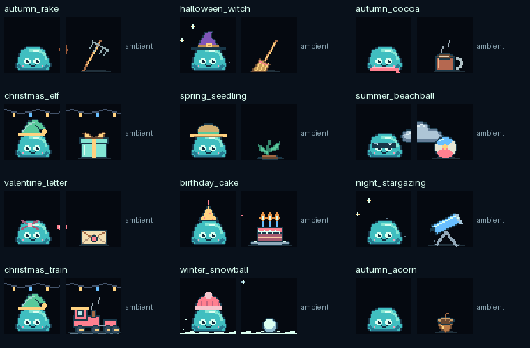

# A second look at every world prop

[World settings](world.md) · [Art inventory](artwork.md) · [Scene catalog](world-catalog.md)

## What still needed work

The first redraw made the objects identifiable, but a readable icon beside Jelly is not the same thing as a believable activity. The rake needed ground contact and leaves that actually move. The cup needed to reach Jelly's hand. Gifts needed a lid and an opened state. Tiny glints alone did not explain what Jelly was doing.

The second pass adds 26 manipulable props across 15 action recipes. They use the same production scene director and Jelly pose renderer as the device. The remaining objects are deliberately ambient: a moon is not a toy to pick up, and candles, fireworks and weather can tell a clear story without being carried.



The gallery shows native 80px key frames; the stage labels are documentation only and do not appear on the device. [Enlarged raking sequence](world-raking.gif).

## How a prop works

A prop is now both a reusable sprite and, when appropriate, a small stateful scene object. Its identity and key remain stable through the sequence. Resting, held, in-use and outcome sprites are separate from Jelly's body. The body, eyes and other character art are unchanged; existing poses and gestures connect the action. The scarf overlay was lowered after review so it no longer crosses the face during object use.

Jelly notices the object, approaches with a real adjacent-key hop, moves beside it, reaches, uses it, releases it and reacts. A foreground layer attaches the tool or small object near the hand. Ground objects and outcomes stay behind Jelly. A rake's articulated head moves over the floor while leaves converge into a pile. At the end Jelly can hop back, leaving the pile behind. Single-key scenes keep the actor and object together at a compact scale.

This is authored animation with bounded state, not a general physics engine. Grip positions are authored for the selected poses. Ball arcs, water drops and leaf gathering are deterministic visual effects. Existing menu, agent, tap, update and coffee behavior takes priority and cancels the activity. No object gains a synthetic permission or browser action.

## Individual assessments

“Ambient” below means the existing revised silhouette and material animation are retained after inspection. These are intentional scenery decisions, not claims that an unimplemented manipulation exists.

| Prop | Assessment at key size | Implemented behavior or refinement |
| --- | --- | --- |
| Acorn | Cap, nut and stem read well; a glint alone felt lifeless. | Jelly lifts it, moves it while inspecting, then puts it down. |
| Balloon | Recognizable silhouette and string; carrying it would add clutter. | Ambient bobbing, string movement and upward background drift. |
| Beach ball | Color panels read clearly; movement needed a cause. | Jelly approaches and plays beside it; authored bounce arcs return it to the floor. |
| Broom | Bristles distinguish it from the rake; standing beside it was insufficient. | Held sweeping strokes gather small floor leaves. |
| Cake | Frosting and candles read well, but perpetual flames lacked an outcome. | Jelly leans in and blows; flames go out after the blowing starts, with smoke afterward. |
| Candy | Wrappers are readable, but the action was only a shine. | Jelly lifts the candy; a bite variant remains after tasting. |
| Canister | Label and smoke make its purpose clear. | Ambient rising puffs remain separate from the grounded canister. |
| Clock | Dial and hands are readable. | Ambient moving second hand; no arbitrary pickup. |
| Cloud | Shaded lobes read as a cloud rather than a flat oval. | Ambient cloud drift and rain; no ground shadow or pickup. |
| Clover | Four lobes are compact enough to need closer attention. | Jelly lifts and examines it rather than leaving it as a small static plant. |
| Cocoa | Handle and steam read clearly; it needed to be used. | Jelly picks up the mug, makes small sipping movements and sets it down. |
| Crescent | The cutout is recognizable and should remain celestial. | Ambient moon highlight; keep it out of the hand. |
| Diya | Bowl and flame are recognizable at this scale. | Ambient flame variation, with the bowl kept stationary. |
| Dreidel | Faceted body reads well; spinning should follow an action. | Resting pose before use, spin during play, then a short coast. |
| Eggs | The decorated eggs read as a group. | Jelly lifts and inspects the small group. Individual egg picking is not simulated. |
| Fan | Grille and stand distinguish it from a pinwheel. | Ambient powered rotor; it does not need Jelly to turn it. |
| Feast | Plate, roast and garnish identify the scene. | Ambient steam; the whole feast is not lifted to Jelly's face. |
| Flower | Overlapping petals and center read more clearly than separate dots. | Jelly holds a watering can and sends drops toward the plant. |
| Fountain | Grounded base and sparks explain its role. | Ambient spark trajectories; no carried firework. |
| Gift | Ribbon and lid read well, but a closed box had no payoff. | Jelly opens it; the lid rises and the dark box interior remains visible. |
| Globe | Ocean, land and stand read as a globe. | Ambient highlight; keep it grounded rather than bouncing like a beach ball. |
| Grass | Individual blades establish ground texture. | Ambient sway and firefly context; no giant grass object in the hand. |
| Heart | Clear symbolic silhouette rather than a real-world solid. | Jelly gently lifts and examines it as a small token. |
| Icicles | Tapered hanging forms read differently from snowflakes. | Ambient drips and glints; remain attached overhead. |
| Kite | Panels and tail are clear. | Ambient suspended kite with a moving tail; a held string interaction is not implemented. |
| Lamp | Shade and stand distinguish it from a hanging lantern. | Ambient warm light; remains stationary. |
| Lantern | Ribs, handle and tassel give it structure. | Ambient glow and tassel motion; stays suspended. |
| Leaf | Lobes and veins are identifiable; it needed real flutter. | Face/edge/back silhouette poses; Jelly can lift and inspect a foreground leaf. |
| Lemonade | Straw, lemon slice and glass separate it from cocoa. | Jelly lifts the drink, sips and returns it to the floor. |
| Letter | Closed envelope alone gave no readable story. | Jelly lifts it; the flap opens and a sheet with writing is revealed. |
| Menorah | Branches, central stem and nine flames are visible. | Ambient candle flicker; do not wave the whole object around. |
| Mittens | Cuffs and thumbs distinguish the pair. | Ambient connecting-cord movement. A fitting/wearing sequence is not implemented. |
| Music | Notes are symbolic and already legible. | Ambient floating notes; do not treat them as a physical tool. |
| Pie | Crust and plate read clearly. | Jelly lifts the small serving and tastes it; a bite cutout persists. |
| Pinwheel | Colored blades are distinct from the powered fan. | Still before use; Jelly blows, the wheel spins and then coasts. |
| Popsicle | Stick, highlight and colored ice are clear. | Jelly lifts it for a taste, leaving a bite in the ice. |
| Pot | Gold and dark rounded vessel read as a pot of coins. | Ambient metallic sparkle; no invented coin-collection mechanic. |
| Powder | Separate colored mounds and bowls explain the material. | Ambient small powder particles; keep color effects away from Jelly's face. |
| Puddle | Reflection and ripples make it recognizably water. | Ambient ripples and rain splashes. A causal jump/splash interaction is not implemented. |
| Pumpkin | Ribs, stem and glowing face read well. | Ambient internal light changes; remains a grounded seasonal prop. |
| Rake | Head and tines read well, but it was only an icon. | Separate held tool, floor-contact strokes, smaller leaves, gathered pile and put-down. |
| Rangoli | Colored petal pattern reads as floor decoration. | Ambient restrained center highlight; pattern stays on the floor. |
| Rocket | Cone, shaft and tail identify a small firework. | Ambient launch/flame animation; no pickup or lighting gesture. |
| Sandcastle | Towers, doorway and flag distinguish it from blocks. | Jelly works beside a partial structure, then reveals the completed castle. |
| Scythe | Blade is distinct from broom and rake. | Ambient blade highlight; remains costume scenery rather than borrowing the rake action. |
| Seedling | Stem, two leaves and soil read clearly. | Held watering can and falling drops; plant remains rooted. |
| Sled | Runners, seat and cord are identifiable. | Ambient cord sway. Riding is not implemented in this pass. |
| Snow angel | The imprint is readable but should not float or be carried. | Ambient snow impression; preserve the ground silhouette. |
| Snowball | Shading reads as a small ball of snow. | Jelly plays with authored toss/bounce arcs, then leaves it on the floor. |
| Snowflake | Branched silhouette is recognizable. | Ambient small sparkle; keep it airborne. |
| Snowman | Hat, face, scarf and twig arms read clearly. | Partial snow form during the early build, then a completed snowman. |
| Sweets | Small pieces on a plate are intentionally modest in size. | Jelly lifts a serving and tastes it, leaving a bite variant. |
| Telescope | Tube and tripod are readable; pointing was not enough. | Jelly leans toward a separate eyepiece extension while a small star moves overhead. |
| Train | Wheels, cab and wagon read as a train. | Jelly nudges it; the chassis moves a short distance and wheel/steam animation continues. |
| Tree | Tiered branches and ornaments read clearly. | Ambient lights remain small and the trunk stays grounded. |
| Window | Frame, crossbars and sill establish the setting. | Ambient rain runs within panes; the frame stays still. |
| Windsock | Open mouth, stripes and pole explain the object. | Ambient fabric movement; pole remains planted. |

## Controls and verification

`ocdeck world configure --no-interactions` restores ambient-only behavior. `--interaction-seconds 24` sets the minimum rest interval after a completed activity; `--no-props` and reduced motion disable manipulation too. Restart after changes. See [world controls](world.md#jelly-can-use-its-props).

```console
python scripts/preview_world_interactions.py
python -m unittest discover -s tests -p test_world_interactions.py
```

Tests cover every manipulation at 72/80/96px, all supported layouts, one or several free keys, no free keys, interrupted sequences, stable prop placement, occupied/disconnected keys, outcome persistence, menu/help/agent priorities and CLI/INI round trips. Previews use production code and were inspected at native and enlarged size. Physical-device validation is still required.
